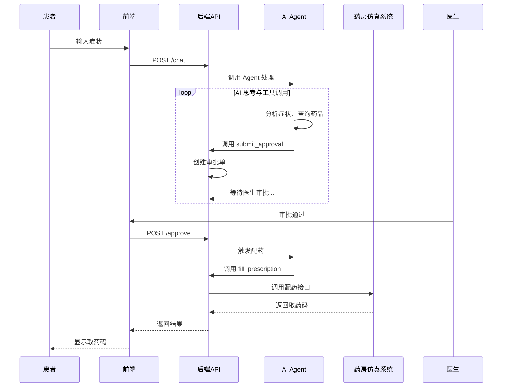

# AI 开药助手 —— 团队项目说明文档

## 一、项目概述

一个 **AI 辅助开药系统**：患者描述症状 → AI 推荐药物 → **所有用药建议必须经过医生审批** → 审批通过后自动调用药房仿真系统完成配药。另外，管理员在后台管理药品库存、查看出入库报告并生成采购建议。

---

## 二、核心功能

| 角色 | 功能 |
|------|------|
| **患者** | 聊天输入症状、查看 AI 思考过程、等待医生审批、获取取药码、查询用药历史 |
| **医生** | 查看待审批建议（**所有药物均需审批**）、批准/拒绝并填写理由、查看历史处方 |
| **药房** | 药房仿真系统独立运行，接收处方请求，扣减库存，生成取药码 |
| **管理员** | 登录后台，查看药品列表（含处方/非处方标记）、添加/编辑/删除药品、查看出入库报告（按日/周/月）**、**系统自动生成采购建议（基于库存下限和出库速度） |
| **系统** | 自动检查过敏、计算剂量、查库存、推荐替代药物、复诊提醒、记录所有审批操作日志、自动调用药房仿真系统 |

---

## 三、技术栈

| 领域 | 技术 |
|------|------|
| 后端核心 | Python 3.10+ |
| AI 模型 | Anthropic Claude API（或 OpenAI GPT，需适配） |
| Web 框架 | FastAPI |
| 前端 | HTML + CSS + 原生 JS |
| 数据库 | SQLite |
| 测试 | pytest |
| 版本控制 | Git + GitHub |
| 外部集成 | 药房仿真系统（REST API） |

---

## 四、如何基于模块化架构开发？

P1模块已经完成了医疗用药助手Agent的核心框架，采用**模块化、可扩展的架构**。与原始计划书中基于`learn-claude-code`复制粘贴的方式不同，当前实现采用了更专业的分层架构，提高了代码的可维护性和可扩展性。

### 4.1 项目结构对比（更新版）

| 模块 | 当前实现文件 | P1职责 | 说明 |
|------|--------------|--------|------|
| **核心Agent** | `core/agent.py`（`MedicalAgent`类） | ✅ P1完成 | 医疗助手核心，支持工作流管理、状态保存/恢复 |
| **LLM客户端** | `llm/client.py`（`LLMClient`类） | ✅ P1完成 | 统一LLM客户端，支持Claude、OpenAI、DeepSeek等多提供商 |
| **工具系统** | `tools/`目录（`base.py`, `executor.py`, `registry.py`） | ✅ P1完成框架 | 标准化工具接口，支持同步/异步执行 |
| **记忆管理** | `memory/`目录（`manager.py`, `compressor.py`） | ✅ P1完成 | 消息历史管理，支持智能压缩和token估算 |
| **会话管理** | `session/manager.py` | ✅ P1完成 | 会话状态保存和恢复 |
| **工作流管理** | `core/workflows.py` | ✅ P1完成 | 跟踪患者咨询流程状态 |
| **配置管理** | `config.py` | ✅ P1完成 | 全局配置，支持环境变量验证和DeepSeek配置 |
| **工具函数** | `utils/`目录多个文件 | ✅ P1完成 | JSON处理、文本工具、验证、重试等通用功能 |
| **医疗工具实现** | `tools/medical.py` | 🔄 P2负责 | 具体的医疗工具函数（当前为mock实现） |
| **数据库模块** | `drug_db.py` | 🔄 P2负责 | 药品数据库操作（当前为占位实现） |
| **库存管理** | `tools/inventory.py` | 🔄 P2负责 | 库存记录和报告（当前为占位实现） |
| **报告生成** | `tools/report_generator.py` | 🔄 P2负责 | 各种报告生成（当前为占位实现） |
| **规划器** | `planner.py` | 🔄 P3负责 | TodoWrite规划器（当前使用占位类） |
| **子代理** | `subagents/`目录 | 🔄 P3负责 | 症状提取子代理（当前使用占位函数） |
| **后端API** | `api/`目录 | 🔄 P4负责 | FastAPI后端接口 |
| **前端页面** | `web/`目录 | 🔄 P5负责 | HTML/CSS/JS前端界面 |
| **审批模块** | `approval.py`, `audit_logger.py` | 🔄 P6负责 | 审批管理和审计日志 |

### 4.2 具体修改步骤（按角色，基于当前架构）

#### 步骤 1：理解现有架构（所有人先做）
```bash
# 克隆仓库（如果尚未克隆）
git clone https://github.com/clouder1128/ROS2-based-Intelligent-Medicine-Pickup-System.git
cd ROS2-based-Intelligent-Medicine-Pickup-System/P1

# 查看项目结构
tree -I "__pycache__|*.pyc|venv|.pytest_cache" --dirsfirst
```

#### 步骤 2：使用现有MedicalAgent（P1已完成）
- P1已完成`MedicalAgent`类，位于`core/agent.py`
- 系统提示词已配置为医疗场景（见`SYSTEM_PROMPT`）
- 工具定义已在`tools/registry.py`中定义（6个医疗工具）
- 工作流管理已集成，自动跟踪患者咨询状态

**使用示例：**
```python
from core.agent import MedicalAgent

# 创建医疗助手Agent
agent = MedicalAgent()

# 运行对话
response, steps = agent.run("患者头痛，请推荐药物", patient_id="patient_123")
print(f"助手回复: {response}")
print(f"执行步骤: {len(steps)}步")
```

#### 步骤 3：实现医疗工具函数（P2负责）
P1已提供工具框架，P2需要完成具体实现：

1. **完善`tools/medical.py`**：替换当前的mock实现为真实逻辑
   - `query_drug()`：连接真实药品数据库查询
   - `check_allergy()`：实现过敏检查逻辑
   - `calc_dosage()`：实现剂量计算算法
   - `generate_advice()`：生成结构化建议
   - `submit_approval()`：连接审批系统
   - `fill_prescription()`：调用药房仿真系统API

2. **实现数据库模块**：
   - 完善`drug_db.py`：实现真实的SQLite数据库操作
   - 根据第五部分的表结构创建数据库

3. **实现库存和报告模块**：
   - 完善`tools/inventory.py`：实现真实库存管理
   - 完善`tools/report_generator.py`：实现真实报告生成

#### 步骤 4：集成规划器和子代理（P3负责）
P1已预留集成接口，P3需要：

1. **实现`planner.py`**：创建`TodoManager`类替换占位类
2. **实现`subagents/symptom_extractor.py`**：创建症状提取子代理替换占位函数
3. **测试集成**：确保与`MedicalAgent`正常协作

**当前占位机制**：P1使用条件导入，如果P3模块不存在则使用占位实现，确保系统可独立运行。

#### 步骤 5：搭建后端API（P4负责）
基于现有架构实现：

1. **创建`api/main.py`**：FastAPI应用
2. **实现端点**：
   - `/chat`：调用`MedicalAgent.run()`
   - `/approve`：审批接口，审批通过后自动调用`fill_prescription`
   - `/pending`, `/admin/*`等端点
3. **集成配置**：使用`Config`类管理环境变量

#### 步骤 6：开发前端页面（P5负责）
与计划书相同，创建5个HTML页面，调用P4的API。

#### 步骤 7：实现审批模块与测试（P6负责）
1. **实现`approval.py`**：`ApprovalManager`类，SQLite存储
2. **实现`audit_logger.py`**：审计日志
3. **编写测试**：在`tests/`目录添加测试用例

### 4.3 已完成的代码（无需修改）

以下模块已由P1完成，可直接使用：

1. **核心Agent框架**：`MedicalAgent`类，支持状态保存/恢复
2. **LLM集成**：支持Claude、OpenAI、DeepSeek，带重试和统计
3. **工具调用系统**：`ToolExecutor`统一管理工具执行
4. **消息管理**：智能压缩和token估算
5. **工作流跟踪**：自动记录咨询流程状态
6. **配置管理**：环境变量验证和DeepSeek支持
7. **完整测试套件**：98个测试用例，100%通过

### 4.4 向后兼容性

当前架构保持向后兼容：

1. **工具调用接口**：`execute_tool()`函数与原始`TOOL_HANDLERS`模式兼容
2. **LLM客户端**：`chat()`方法接受字典列表，返回字典格式
3. **Agent API**：`MedicalAgent.run()`返回`(reply, steps)`格式
4. **条件导入**：P3模块不存在时使用占位实现

### 4.5 工作量重新评估

基于当前实现重新评估：

- **P1已完成代码**：约6600行（包含测试、文档）
- **P2待完成代码**：约1500行（医疗工具、数据库、报告）
- **P3待完成代码**：约800行（规划器、子代理）
- **P4待完成代码**：约2100行（后端API）
- **P5待完成代码**：约3300行（前端）
- **P6待完成代码**：约1450行（审批、测试、配置）
- **总计**：约15750行（比原计划增加，因为架构更完善）

### 4.6 与药房仿真系统的集成（直接 API 调用）

本节说明如何将你们已开发的药房仿真系统无缝接入 AI 开药助手。

#### 集成架构

采用 **直接 API 调用** 方式：医生审批通过后，后端 API 直接调用药房仿真系统的配药接口，完成库存扣减和取药码生成。



#### 具体实现

**1. 在 `tools/medical.py` 中已实现 `fill_prescription` 工具（P2负责完善）**

当前为mock实现，P2需要替换为真实API调用：

```python
# tools/medical.py（当前为mock实现，P2需完善）
async def fill_prescription(prescription_id: str, patient_name: str, drugs: list) -> str:
    """
    将已审批的处方发送给药房仿真系统进行配药。
    """
    pharmacy_url = Config.PHARMACY_BASE_URL
    
    async with httpx.AsyncClient() as client:
        try:
            response = await client.post(
                f"{pharmacy_url}/api/dispense",
                json={
                    "prescription_id": prescription_id,
                    "patient_name": patient_name,
                    "drugs": drugs
                },
                timeout=30.0
            )
            response.raise_for_status()
            result = response.json()
            return f"✅ 配药成功！取药码：{result.get('pickup_code')}。请凭码取药。"
        except httpx.HTTPStatusError as e:
            return f"❌ 配药失败：{e.response.text}"
        except Exception as e:
            return f"❌ 调用药房系统失败：{str(e)}"
```

**2. 工具JSON Schema已在 `tools/registry.py` 中定义**

P1已完成工具定义，包括`fill_prescription`的输入模式。

**3. 在 `/approve` 接口中调用配药工具（P4负责）**

```python
# api/routes.py（P4实现）
from tools.medical import fill_prescription

@app.post("/approve")
async def approve_prescription(approval_id: str, doctor_id: str):
    # 1. 更新审批单状态为 approved
    # 2. 获取关联的处方数据（从 approvals 表或临时生成）
    # 3. 调用配药工具
    result = await fill_prescription(
        prescription_id=prescription_data['id'],
        patient_name=prescription_data['patient_name'],
        drugs=prescription_data['drugs']
    )
    # 4. 将结果返回前端，前端展示取药码
    return {"status": "approved", "dispense_result": result}
```

**4. 配置药房仿真系统地址**

在 `.env` 文件中增加：
```env
PHARMACY_BASE_URL=http://localhost:8001
```

**5. 当前支持模式**
- **Mock模式**：当`PHARMACY_BASE_URL`为默认值时，使用模拟响应
- **真实API模式**：当配置真实URL时，调用实际药房系统
- **同步/异步支持**：`ToolExecutor`自动处理异步函数## 五、数据库表结构（完整）

由 P2 创建 `schema.sql`：

```sql
-- 药品表
CREATE TABLE drugs (
    id INTEGER PRIMARY KEY AUTOINCREMENT,
    name TEXT UNIQUE NOT NULL,
    specification TEXT,          -- 规格，如 "500mg/片"
    price REAL DEFAULT 0.0,
    stock INTEGER DEFAULT 0,
    is_prescription BOOLEAN DEFAULT 1,  -- 1=处方药，0=非处方药（仅记录，不影响审批）
    min_stock_threshold INTEGER DEFAULT 50,  -- 库存下限
    created_at DATETIME DEFAULT CURRENT_TIMESTAMP
);

-- 出入库流水表
CREATE TABLE transactions (
    id INTEGER PRIMARY KEY AUTOINCREMENT,
    drug_id INTEGER NOT NULL,
    type TEXT NOT NULL,          -- 'in' 或 'out'
    quantity INTEGER NOT NULL,
    reason TEXT,                 -- 如 "医生处方"、"管理员补货"
    timestamp DATETIME DEFAULT CURRENT_TIMESTAMP,
    FOREIGN KEY (drug_id) REFERENCES drugs(id)
);

-- 审批单表
CREATE TABLE approvals (
    id TEXT PRIMARY KEY,         -- 唯一ID，如 "AP-20250401-001"
    patient_name TEXT NOT NULL,
    patient_age INTEGER,
    patient_weight REAL,
    symptoms TEXT,
    advice TEXT NOT NULL,        -- AI 生成的建议文本
    drug_name TEXT,              -- 推荐的药品名称
    drug_type TEXT,              -- 'prescription' 或 'otc'（仅记录）
    status TEXT NOT NULL,        -- 'pending', 'approved', 'rejected'
    doctor_id TEXT,              -- 审批的医生ID
    reject_reason TEXT,
    created_at DATETIME DEFAULT CURRENT_TIMESTAMP,
    approved_at DATETIME
);

-- 处方表（审批通过后生成）
CREATE TABLE prescriptions (
    id TEXT PRIMARY KEY,         -- 处方号，如 "RX-20250401-001"
    approval_id TEXT NOT NULL,   -- 关联审批单
    patient_name TEXT NOT NULL,
    drugs TEXT,                  -- JSON 数组，如 '[{"name":"阿莫西林","dosage":"500mg","quantity":2}]'
    status TEXT DEFAULT 'pending', -- 'pending', 'dispensed'
    created_at DATETIME DEFAULT CURRENT_TIMESTAMP,
    dispensed_at DATETIME,
    pickup_code TEXT,            -- 从药房仿真系统返回的取药码
    FOREIGN KEY (approval_id) REFERENCES approvals(id)
);

-- 用药历史表（患者视角）
CREATE TABLE patient_history (
    id INTEGER PRIMARY KEY AUTOINCREMENT,
    patient_name TEXT NOT NULL,
    prescription_id TEXT NOT NULL,
    drugs TEXT,
    advice TEXT,
    created_at DATETIME DEFAULT CURRENT_TIMESTAMP
);

-- 审计日志表
CREATE TABLE audit_logs (
    id INTEGER PRIMARY KEY AUTOINCREMENT,
    user_id TEXT,
    action TEXT,                 -- 如 "approve", "reject", "add_drug", "update_stock"
    details TEXT,                -- JSON 格式的详情
    ip_address TEXT,
    timestamp DATETIME DEFAULT CURRENT_TIMESTAMP
);
```

---

## 六、团队分工与代码量（6人，总12000行）

| 角色 | 名称 | 核心任务 | 代码量 | 主要产出文件 |
|------|------|----------|--------|--------------|
| P1 | Agent核心工程师 | Agent循环、工具注册、LLM调用 | 1500 | `agent_core.py`, `tools/registry.py`, `llm_client.py`, `message_manager.py`, `config.py`, `exceptions.py`, `utils.py`, `test_agent.py` |
| P2 | 医疗工具与知识库工程师 | 医疗工具实现、数据库、报告算法、**药房仿真系统集成** | 2900 | `tools/medical.py`（含 `fill_prescription`）, `drug_db.py`, `tools/inventory.py`, `report_generator.py`, `schema.sql`, `init_db.py` |
| P3 | 规划与子代理工程师 | TodoWrite、任务持久化、症状提取子代理 | 1300 | `planner.py`, `task_storage.py`, `subagents/symptom_extractor.py` |
| P4 | 后端API工程师 | FastAPI路由、所有API端点、**审批通过后自动配药** | 2100 | `api/main.py`, `api/routes.py`, `api/admin_routes.py`, `api/schemas.py` |
| P5 | 前端工程师 | 5个网页 + CSS + JS | 3300 | `web/patient.html`, `web/doctor.html`, `web/pharmacy.html`, `web/history.html`, `web/admin.html`, `web/css/style.css`, `web/js/app.js` |
| P6 | 测试/审批/集成工程师 | 审批模块、审计日志、测试、配置 | 1450 | `approval.py`, `audit_logger.py`, `auth.py`, `tests/`, `.env.example`, `requirements.txt`, `README.md` |
| **合计** | | | **12000** | |

> **说明**：P2 的 2900 行中包含约 1400 行数据（药物信息和冲突规则），可由全队分担录入，实际编程量约 1500 行。总代码量不变。

---

## 七、API 接口契约（P4 提供，P5 依赖）

| 端点 | 方法 | 请求体/参数 | 响应体示例 |
|------|------|-------------|------------|
| `/chat` | POST | `{"message": "我发烧", "patient_id": "张三"}` | `{"reply": "已提交审批", "steps": [...], "approval_id": "AP-001"}` |
| `/approve` | POST | `{"approval_id": "AP-001", "action": "approve", "doctor_id": "dr1"}` | `{"status": "approved", "dispense_result": "✅ 配药成功！取药码：123456"}` |
| `/pending` | GET | `?doctor_id=dr1` | `[{"id":"AP-001","patient":"张三","advice":"..."}]` |
| `/prescription/{id}` | GET | - | `{"status":"dispensed", "pickup_code":"123456", "drugs":[...]}` |
| `/history` | GET | `?patient_name=张三` | `[{"prescription_id":"RX-001", "drugs":"...", "date":"..."}]` |
| `/admin/drugs` | GET | `?page=1` | `{"drugs":[...], "total":50}` |
| `/admin/drugs` | POST | `{"name":"阿莫西林","price":10,"stock":100,"is_prescription":true}` | `{"id":123}` |
| `/admin/drugs/{id}` | PUT | `{"price":12,"stock":80}` | `{"status":"ok"}` |
| `/admin/drugs/{id}` | DELETE | - | `{"status":"ok"}` |
| `/admin/report` | GET | `?start=2025-04-01&end=2025-04-30` | `[{"drug_name":"阿莫西林","in":200,"out":150,"end_stock":50}]` |
| `/admin/purchase-suggestions` | GET | - | `[{"drug_name":"阿莫西林","current_stock":20,"daily_avg_out":10,"suggested":80}]` |

---

## 八、审批流程详细说明（含药房集成）

1. **患者输入症状** → 前端 POST `/chat`。
2. **后端调用 `run_agent()`** → Agent 内部调用工具 → 最终调用 `submit_approval` → 返回 `approval_id`。
3. **医生登录** → 前端 GET `/pending` 显示列表。
4. **医生点击通过** → POST `/approve` with `action="approve"`。
5. **后端更新审批单状态** → 调用 `ApprovalManager.approve()` → 记录审计日志。
6. **后端自动调用 `fill_prescription` 工具** → 向药房仿真系统发送配药请求。
7. **药房仿真系统扣减库存、生成取药码** → 返回取药码。
8. **后端将取药码存入处方表** → 返回前端 `dispense_result`。
9. **患者刷新页面或收到通知** → 看到取药码 → 凭码到药房取药。
10. **药房人员** → 输入取药码 → 调用 `/prescription/{id}` 确认取药 → 更新处方状态为 `dispensed`。

---

## 九、开发流程（6周）

### 第 0 周（准备）
- 阅读 `learn-claude-code` 文档，跑通 `s01` 和 `s02`。
- 创建 GitHub 仓库，初始化分支。
- P4 编写 API 文档（Markdown），P2 编写 `schema.sql`。
- P1 复制基础文件到项目目录。
- 确认药房仿真系统的接口地址和格式。

### 第 1-2 周（并行开发）
- P1：实现 `agent_core.py`，集成规划器（P3 协助），使用 P2 提供的 mock 工具。
- P2：实现数据库和工具函数（先返回假数据），完成 `drug_db.py`，**实现 `fill_prescription` 的 mock 版本**。
- P3：实现 `planner.py` 和症状提取子代理。
- P4：搭建 FastAPI 框架，实现所有端点的 mock 响应，**包括 `/approve` 中调用 `fill_prescription` 的逻辑**。
- P5：写出所有 HTML 静态页面，CSS 基本样式。
- P6：实现 `ApprovalManager` 和审计日志，编写基础测试。

### 第 3-4 周（集成）
- P1 & P2：替换 mock 工具为真实数据库查询，**`fill_prescription` 改为真实调用药房仿真系统**。
- P4：替换 mock API 为真实调用 P1/P2/P6 的函数，**确保 `/approve` 完整触发配药流程**。
- P5：联调前后端，完善交互（加载动画、错误提示、取药码展示）。
- P6：编写单元测试和端到端测试（包含审批通过后自动配药），修复 bug。

### 第 5-6 周（打磨与交付）
- 全员：修 bug，完善文档，录制演示视频。
- P5：美化前端，增加响应式设计。
- P6：最终测试覆盖率 > 70%，准备答辩 PPT。

---

## 十、如何运行最终项目

```bash
# 克隆仓库
git clone <你们的仓库地址>
cd our_project

# 安装依赖
pip install -r requirements.txt
cp .env.example .env   # 填入 ANTHROPIC_API_KEY 和 PHARMACY_BASE_URL

# 初始化数据库
python init_db.py

# 启动药房仿真系统（独立服务，假设已开发好）
python pharmacy_simulator.py --port 8001

# 启动主后端
uvicorn api.main:app --reload --port 8000

# 访问前端（静态文件由 FastAPI 托管）
# 患者端：http://localhost:8000/static/patient.html
# 医生端：http://localhost:8000/static/doctor.html
# 管理员端：http://localhost:8000/static/admin.html
```

---

## 十一、每个成员需要阅读的材料

| 角色 | 必读材料 |
|------|----------|
| 全员 | `learn-claude-code/README.md`（理解 Agent vs Harness） |
| P1 | `learn-claude-code/docs/en/s01-the-agent-loop.md`, `s02-tool-use.md` |
| P2 | `learn-claude-code/docs/en/s05-skill-loading.md`, `s06-context-compact.md`；SQLite 教程；`httpx` 库文档 |
| P3 | `learn-claude-code/docs/en/s03-todo-write.md`, `s04-subagent.md`, `s07-task-system.md` |
| P4 | FastAPI 官方教程（前 3 章）；`httpx` 异步调用 |
| P5 | HTML/CSS/JS 基础；Fetch API |
| P6 | pytest 文档；Python logging 模块 |

---

## 十二、最终交付物

1. **GitHub 仓库**：包含所有源代码、数据库初始化脚本、示例数据、测试、文档。
2. **演示视频**（5-6 分钟）：完整跑通一个患者咨询 → AI 建议 → 医生审批 → 自动配药 → 获取取药码 → 药房确认取药 → 管理员查看报告。
3. **答辩 PPT**：每人 3 分钟介绍自己模块，展示系统架构和亮点。
4. **项目报告**（3-4 页 PDF）：项目背景、功能列表、技术选型、分工说明、遇到的困难与解决方案。

---

## 十三、常见问题

**Q：我们不会修改 `learn-claude-code` 的复杂部分怎么办？**  
A：核心循环和工具注册代码已经写好，你只需要修改 `TOOLS` 列表和 `SYSTEM` 提示词，以及替换工具处理函数。所有复杂的异步、压缩等都可以先不加。

**Q：药房仿真系统需要提供什么接口？**  
A：只需提供 `POST /api/dispense`，接收 JSON `{"prescription_id", "patient_name", "drugs"}`，返回 `{"pickup_code": "xxx"}`。如果你们已有不同格式，P2 可以适配。

**Q：前端 3300 行会不会太多？**  
A：5 个页面，每个页面平均 660 行。一个页面包含 HTML（~150）、CSS（~200）、JS（~300）很容易达到。加上公共组件，3300 行合理。

**Q：如何确保代码量统计准确？**  
A：使用 `cloc` 工具统计。所有手写的 `.py`, `.js`, `.html`, `.css`, `.sql`, `.md`（知识库）都算。测试用例和配置文件也算。

**Q：我们只有 6 周，能完成吗？**  
A：按照上面的并行开发计划，每天每人写 50-60 行代码，加上测试和文档，完全可以。关键是不要追求完美，先让主线跑通。

