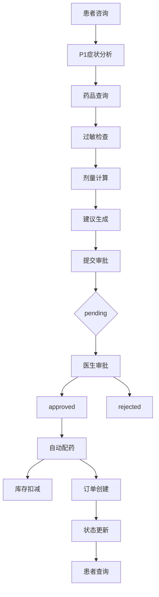

# 智能药房完整工作流测试与集成指南

## 📋 概述

本文档提供智能药房系统的完整工作流测试方法、审批操作指南以及前端集成准备。系统实现了从患者咨询到药品配发的全自动化流程：

```
患者咨询 → P1分析症状 → AI生成用药建议 → 提交审批 → 
医生批准 → 后端自动配药 → 库存扣减 → 状态查询
```

## 🚀 环境准备

### 1. 启动后端服务
```bash
# 进入backend目录
cd backend

# 启动Flask后端（端口8001）
python app.py
# 或使用make命令
make start-backend

# 验证后端运行
curl http://localhost:8001/api/health
```

### 2. 准备P1医疗助手
```bash
# 进入P1目录
cd P1

# 安装依赖（如果未安装）
pip install -r requirements.txt

# 配置环境变量（复制.env.example）
cp .env.example .env
# 编辑.env文件，设置DEEPSEEK_API_KEY等配置
```

### 3. 初始化数据库
后端启动时会自动创建SQLite数据库（`pharmacy.db`）并填充示例药品数据。

### 4. 使用Makefile快捷命令
```bash
# 查看所有可用命令
make help

# 启动完整集成环境
make quick-start

# 运行完整集成测试
make test-integration

# 单独启动后端
make backend-start

# 停止后端
make backend-stop

# 运行单元测试
make test

# 清理临时文件
make clean
```

## 🔄 完整工作流测试

### 测试脚本（推荐）
运行自动化集成测试脚本：
```bash
python scripts/test-full-integration.py
```

### 手动测试步骤

#### 步骤1：启动P1 CLI
```bash
cd P1
python cli.py
```

#### 步骤2：患者咨询
在P1 CLI中输入患者信息：
```
王建国,头痛，年龄30，体重70kg，无过敏史，病情中度
```

系统将自动执行以下工作流：
1. ✅ **症状分析** - 提取结构化信息
2. ✅ **药品查询** - 查询"头痛"相关药品
3. ✅ **过敏检查** - 确认无过敏风险
4. ✅ **剂量计算** - 根据年龄、体重、病情计算剂量和药品数量（轻度=1，中度=2，重度=3，儿童减半）
5. ✅ **建议生成** - 生成结构化用药建议
6. ✅ **提交审批** - 提交用药建议和药品数量，返回审批ID（如`AP-20260408-ABCD1234`）

#### 步骤3：验证审批提交
```bash
# 检查审批是否创建
curl "http://localhost:8001/api/approvals/pending"

# 查看特定审批详情
curl "http://localhost:8001/api/approvals/AP-20260408-ABCD1234"
```

## 👨‍⚕️ 医生审批操作指南

### 方法1：使用审批脚本（推荐）
```bash
# 交互式模式：列出待审批单并选择
python approve_prescription.py

# 直接批准指定审批单
python approve_prescription.py AP-20260408-ABCD1234
```

### 方法2：手动API调用
```bash
# 批准审批单
curl -X POST "http://localhost:8001/api/approvals/AP-20260408-ABCD1234/approve" \
  -H "Content-Type: application/json" \
  -d '{"doctor_id": "doctor_test_001"}'

# 验证订单创建
curl "http://localhost:8001/api/orders"
```

### 审批后自动执行的操作
1. ✅ **状态更新** - 审批单状态从`pending`变为`approved`
2. ✅ **库存扣减** - 自动扣减相应药品库存
3. ✅ **订单创建** - 创建配药订单
4. ✅ **ROS2任务发布** - 发布机器人配药任务（如果ROS2可用）

## 🔍 患者状态查询

### P1 CLI查询命令
```bash
# 在P1 CLI中使用
/check-status              # 查询当前会话的审批状态
/check-status AP-20260408-ABCD1234  # 查询指定审批ID状态
```

### 直接API查询
```bash
# 查询审批状态
curl "http://localhost:8001/api/approvals/AP-20260408-ABCD1234"

# 查询订单信息
curl "http://localhost:8001/api/orders"
```

### 状态显示示例
```
✅ 已批准
患者: 王建国
症状: 头痛
药品数量: 2
订单状态: 正在配发中
```

## 📱 前端集成指南

### 获取审批ID
前端需要获取审批ID才能查询状态，可以通过以下方式：

#### 方式1：URL参数传递
```javascript
// 从URL获取审批ID，如：http://example.com/status.html?approval_id=AP-20260408-ABCD1234
const urlParams = new URLSearchParams(window.location.search);
const approvalId = urlParams.get('approval_id');

// 如果未找到，提示用户输入
if (!approvalId) {
  approvalId = prompt('请输入您的审批ID:', 'AP-20260408-');
}
```

#### 方式2：本地存储
```javascript
// 保存审批ID到localStorage
localStorage.setItem('approval_id', 'AP-20260408-ABCD1234');

// 读取审批ID
const approvalId = localStorage.getItem('approval_id');
```

#### 方式3：与P1集成
如果前端与P1系统集成，审批ID可以在患者完成咨询后通过以下方式获取：
1. P1返回的JSON响应中的`approval_id`字段
2. P1 CLI的`/status`命令显示
3. 直接查询后端API获取最新审批

### 核心API接口

#### 1. 审批状态查询
```javascript
// GET /api/approvals/{approval_id}
fetch(`http://localhost:8001/api/approvals/${approvalId}`)
  .then(res => res.json())
  .then(data => {
    const status = data.approval.status; // pending/approved/rejected
    const patientName = data.approval.patient_name;
    const quantity = data.approval.quantity;
    // 更新UI
  });
```

#### 2. 订单信息查询
```javascript
// GET /api/orders
fetch('http://localhost:8001/api/orders')
  .then(res => res.json())
  .then(data => {
    const orders = data.data;
    // 查找与审批相关的订单
  });
```

#### 3. 药品库存查询
```javascript
// GET /api/drugs
fetch('http://localhost:8001/api/drugs')
  .then(res => res.json())
  .then(data => {
    const drugs = data.drugs;
    // 显示药品列表和库存
  });
```

### 前端实现方案

#### 方案A：状态轮询（简单实现）
```javascript
// 每30秒查询一次状态
const pollInterval = setInterval(() => {
  fetch(`/api/approvals/${approvalId}`)
    .then(res => res.json())
    .then(data => {
      updateUI(data.approval.status);
      
      // 如果状态改变，停止轮询
      if (data.approval.status !== 'pending') {
        clearInterval(pollInterval);
      }
    });
}, 30000);
```

#### 方案B：WebSocket实时更新（推荐用于生产）
```javascript
// 建立WebSocket连接
const ws = new WebSocket('ws://localhost:8001/ws/approvals');

ws.onmessage = (event) => {
  const data = JSON.parse(event.data);
  if (data.approval_id === approvalId) {
    updateUI(data.status);
  }
};
```

### UI状态显示建议

| 状态 | 图标 | 颜色 | 提示信息 |
|------|------|------|----------|
| pending | 🟡 | 黄色 | 待医生审批 |
| approved | ✅ | 绿色 | 审批通过，正在配药 |
| rejected | ❌ | 红色 | 审批拒绝，请咨询医生 |

## 🧪 测试用例参考

### 测试场景1：完整成功流程
```bash
# 1. 患者咨询
输入：头痛，年龄30，体重70kg，无过敏史，病情中度

# 2. 医生审批
python approve_prescription.py AP-20260408-ABCD1234

# 3. 验证结果
curl "http://localhost:8001/api/approvals/AP-20260408-ABCD1234"
curl "http://localhost:8001/api/orders"
curl "http://localhost:8001/api/drugs?name=布洛芬"
```

### 测试场景2：过敏风险检查
```bash
# 患者有青霉素过敏史
输入：发热，年龄25，体重65kg，青霉素过敏，病情轻度
# 系统应提示过敏风险，不推荐阿莫西林
```

### 测试场景3：儿童剂量计算
```bash
# 儿童患者
输入：发热，年龄8，体重30kg，无过敏史，病情中度
# 系统应计算儿童剂量，药品数量减半
```

## 🔧 故障排除

### 常见问题1：后端服务无法启动
```bash
# 检查端口占用
lsof -i :8001

# 检查Python依赖
pip list | grep flask

# 查看日志
cd backend && python app.py
```

### 常见问题2：P1无法连接后端
```bash
# 检查后端健康状态
curl http://localhost:8001/api/health

# 检查P1配置
cat P1/.env | grep PHARMACY_BASE_URL
```

### 常见问题3：审批提交失败
```bash
# 检查审批API
curl -X POST "http://localhost:8001/api/approvals" \
  -H "Content-Type: application/json" \
  -d '{"patient_name":"测试","advice":"测试建议"}'

# 检查数据库
sqlite3 backend/pharmacy.db "SELECT * FROM approvals;"
```

### 常见问题4：库存扣减失败
```bash
# 检查库存数据
curl "http://localhost:8001/api/drugs"

# 检查订单日志
sqlite3 backend/pharmacy.db "SELECT * FROM order_log;"
```

## 📊 API参考

### 审批相关API
- `GET /api/approvals/{id}` - 获取审批详情
- `POST /api/approvals` - 创建审批
- `POST /api/approvals/{id}/approve` - 批准审批
- `POST /api/approvals/{id}/reject` - 拒绝审批
- `GET /api/approvals/pending` - 获取待审批列表

### 药品相关API
- `GET /api/drugs` - 获取药品列表
- `GET /api/drugs/{id}` - 获取药品详情
- `GET /api/drugs?name={name}` - 按名称搜索药品

### 订单相关API
- `GET /api/orders` - 获取订单列表
- `POST /api/order` - 创建订单（批量）
- `GET /api/health` - 健康检查

## 🔄 工作流状态图



## 📞 技术支持

### 日志查看
```bash
# 后端日志
cd backend && tail -f app.log

# P1日志
cd P1 && tail -f p1.log

# 查看详细工具调用日志
export LOG_LEVEL=DEBUG
```

### 调试模式
```bash
# 启用P1调试模式
cd P1
export DEBUG=true
python cli.py

# 启用后端调试模式
cd backend
export FLASK_DEBUG=1
python app.py
```

## 📈 性能指标

| 指标 | 目标值 | 测试方法 |
|------|--------|----------|
| 完整工作流时间 | < 30秒 | `time python scripts/test-full-integration.py` |
| API响应时间 | < 500ms | `curl -w "%{time_total}" http://localhost:8001/api/health` |
| 并发审批处理 | 10+ TPS | 压力测试脚本 |
| 数据库查询性能 | < 100ms | SQLite性能测试 |

---

**最后更新**: 2026年4月8日  
**版本**: 1.0  
**适用系统**: 智能药房P1+后端集成系统