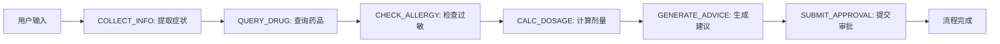

# 医疗助手交互式工作流设计

> **For agentic workers:** REQUIRED SUB-SKILL: Use superpowers:subagent-driven-development (recommended) or superpowers:executing-plans to implement this plan task-by-task. Steps use checkbox (`- [ ]`) syntax for tracking.

**Goal:** 实现代码完全控制的工作流程，LLM仅在判断性任务中发挥作用，满足药品未找到时的交互式处理需求。

**Architecture:** 状态机驱动的工作流程，代码控制状态转换，LLM专注症状提取、风险评估和自然语言生成等判断性任务。支持配置开关选择症状提取模式（LLM或带否定词过滤的规则提取器）。

**Tech Stack:** Python, Pydantic dataclasses, 状态机模式，模块化提示词系统

---

## 设计概述

### 核心原则
1. **代码控制流程**：状态转换由硬编码逻辑管理，LLM不决定下一步该做什么
2. **LLM专注判断**：LLM仅用于需要自然语言理解/生成的任务（症状提取、过敏风险评估、建议生成）
3. **交互简洁**：避免冗长对话，获取关键信息后立即继续流程
4. **可配置提取**：支持LLM和规则两种症状提取模式，默认使用LLM（高精度）
5. **否定词过滤**：改进规则提取器，避免误判否定表述中的症状词（如"无过敏历史"）

### 关键场景处理
- **药品找到**：继续标准工作流（check_allergy → calc_dosage → generate_advice → submit_approval）
- **药品未找到**：向用户反馈识别的症状，建议看医生，等待用户确认
- **症状识别错误**：根据用户纠正重新提取症状，重新开始流程
- **用户接受建议**：结束流程，不创建审批单，记录终止原因

---

## 架构设计

### 状态机扩展

#### WorkflowStep 枚举扩展
```python
class WorkflowStep(Enum):
    # 原有步骤
    COLLECT_INFO = "collect_info"        # 收集患者信息
    QUERY_DRUG = "query_drug"            # 查询药物
    CHECK_ALLERGY = "check_allergy"      # 检查过敏
    CALC_DOSAGE = "calc_dosage"          # 计算剂量
    GENERATE_ADVICE = "generate_advice"  # 生成建议
    SUBMIT_APPROVAL = "submit_approval"  # 提交审批
    
    # 新增交互步骤
    USER_FEEDBACK = "user_feedback"      # 等待用户反馈（药品未找到时）
    TERMINATED_WITHOUT_APPROVAL = "terminated_without_approval"  # 未创建审批单结束
    SYMPTOM_CORRECTION = "symptom_correction"  # 症状纠正处理
```

#### WorkflowState 状态扩展
```python
@dataclass
class WorkflowState:
    patient_id: str
    current_step: WorkflowStep = WorkflowStep.COLLECT_INFO
    completed_steps: List[WorkflowStep] = field(default_factory=list)
    step_data: Dict[WorkflowStep, Dict[str, Any]] = field(default_factory=dict)
    
    # 新增字段
    termination_reason: Optional[str] = None          # 终止原因
    user_feedback_data: Optional[Dict[str, Any]] = None  # 用户反馈数据
    awaiting_user_input: bool = False                 # 是否等待用户输入
    symptoms_corrected: bool = False                  # 症状是否已纠正
    original_user_input: Optional[str] = None         # 原始用户输入（用于重新提取）
    
    # ... 原有字段保持不变（start_time, last_update_time, is_completed, approval_id）
```

### 配置系统增强

#### config.py 新增配置
```python
class Config:
    # ... 原有配置
    
    # 症状提取模式开关
    ENABLE_LLM_SYMPTOM_EXTRACTION = os.getenv(
        "ENABLE_LLM_SYMPTOM_EXTRACTION", "true"
    ).lower() == "true"
    
    # 否定词列表（用于规则提取器改进）
    NEGATION_WORDS = ["无", "没有", "不", "否", "非", "未"]
```

### 提示词系统

独立存储的提示词文件结构：
```
agent_with_backend/P1/prompts/
├── interactive_system_prompt.md    # 主系统提示词
├── feedback_generation.md          # 反馈消息生成提示词
├── symptom_correction.md           # 症状纠正处理提示词
└── advice_generation.md            # 建议生成提示词
```

#### interactive_system_prompt.md 核心内容
```
# 医疗助手交互式系统提示词

## 你的角色
你是医疗用药助手，负责协助患者获取用药建议。

## 工作模式
**重要：你不再控制工作流程，代码会告诉你现在应该做什么。**

当代码调用你时，会提供明确的指令，例如：
- "生成症状反馈消息：症状=[头痛]，建议看医生"
- "处理用户纠正：原始症状=[头痛]，用户说=[不是头痛，是偏头痛]"
- "生成用药建议：药物=[布洛芬]，剂量=[200mg]"

## 你的职责
1. **自然语言生成**：根据指令生成友好、专业的回复
2. **信息提取**：当代码要求时，从文本中提取结构化症状信息
3. **风险评估**：协助评估药物过敏风险
4. **建议生成**：基于药物和剂量生成用药建议

## 交互原则
1. **简洁明了**：回复直接、不冗长
2. **专业友好**：保持医疗专业性，同时语气友好
3. **不主动询问**：只回复代码要求的内容，不主动提问
4. **不控制流程**：不决定下一步该做什么，等待代码指令
```

---

## 工作流程

### 正常流程（药品找到）


### 交互式流程（药品未找到）
```mermaid
graph TD
    A[开始: 用户输入症状] --> B[COLLECT_INFO: 提取症状]
    B --> C[QUERY_DRUG: 查询药品]
    
    C --> D{药品找到?}
    D -->|是| E[继续标准工作流]
    D -->|否| F[USER_FEEDBACK: 反馈症状]
    
    F --> G[生成反馈消息: <br/>"识别症状为[X]，<br/>建议看医生。是否正确？"]
    G --> H{等待用户回复}
    
    H -->|"用户: '是'/'接受'"| I[TERMINATED_WITHOUT_APPROVAL: <br/>记录终止原因，结束流程]
    H -->|"用户: '不是X, 是Y'"| J[SYMPTOM_CORRECTION: <br/>记录纠正信息]
    
    J --> K[重新提取症状: <br/>结合原始输入+纠正信息]
    K --> B
```

### 症状纠正机制
1. **记录纠正信息**：保存用户提供的纠正文本
2. **重新组合输入**：原始输入 + "[用户纠正: ...]"
3. **重新提取症状**：使用配置的提取模式（LLM或规则）
4. **重置状态**：回到QUERY_DRUG步骤，使用新提取的症状

---

## 文件修改清单

### 新增文件
```
agent_with_backend/P1/
├── core/
│   ├── workflow_engine.py          # 状态机执行引擎
│   └── symptom_service.py          # 症状提取服务
├── prompts/                        # 提示词目录
│   ├── interactive_system_prompt.md
│   ├── feedback_generation.md
│   ├── symptom_correction.md
│   └── advice_generation.md
└── services/
    └── judgment_services.py        # 判断性服务集合
```

### 修改文件
| 文件 | 修改内容 | 测试要求 |
|------|----------|----------|
| `core/workflows.py` | 扩展WorkflowStep枚举，添加WorkflowState字段 | 单元测试：状态转换逻辑 |
| `core/agent.py` | 重构run方法，实现状态机，添加交互状态管理 | 集成测试：完整工作流 |
| `core/config.py` | 添加ENABLE_LLM_SYMPTOM_EXTRACTION配置 | 配置测试：开关功能 |
| `subagents/extractor.py` | 添加否定词过滤逻辑 | 单元测试：否定词识别 |
| `subagents/api.py` | 适配新的提取服务接口 | 兼容性测试 |
| `tests/test_core.py` | 添加状态机测试 | 覆盖率要求 > 80% |

---

## 向后兼容性

### API兼容层
```python
class LegacyAgentAdapter:
    """向后兼容适配器，保持原有API"""
    
    @staticmethod
    def create_agent(llm_client=None, message_manager=None):
        """创建新架构的Agent，但暴露原有接口"""
        agent = InteractiveMedicalAgent(llm_client, message_manager)
        return agent
```

### 迁移策略
1. **阶段1**：新增InteractiveMedicalAgent，原有MedicalAgent保持不变
2. **阶段2**：逐步将调用方迁移到新Agent
3. **阶段3**：废弃原有MedicalAgent（可选）

---

## 验收标准

### 功能验收
- [ ] 配置开关工作正常：ENABLE_LLM_SYMPTOM_EXTRACTION=true时使用LLM提取
- [ ] 规则提取器正确过滤否定词："无过敏历史"不被识别为症状
- [ ] 药品找到时继续标准工作流
- [ ] 药品未找到时向用户反馈症状并建议看医生
- [ ] 用户接受建议时结束流程，不创建审批单
- [ ] 用户纠正症状时重新提取并重新开始流程
- [ ] 提示词独立存储为md文件，便于修改

### 性能验收
- [ ] 状态机响应时间 < 100ms（不包括LLM调用）
- [ ] 规则提取器性能比LLM提取快50%以上
- [ ] 内存使用增加 < 20MB

### 质量验收
- [ ] 单元测试覆盖率 > 80%
- [ ] 集成测试覆盖所有工作流分支
- [ ] 代码符合现有代码风格
- [ ] 向后兼容性测试通过

---

## 风险评估与缓解

### 技术风险
1. **状态机复杂性**：状态转换逻辑可能变得复杂
   - **缓解**：保持状态数量最小化，使用清晰的命名
2. **LLM调用延迟**：症状提取LLM调用可能增加延迟
   - **缓解**：提供规则提取器作为快速备选
3. **向后兼容性破坏**：现有调用方可能不兼容
   - **缓解**：提供LegacyAgentAdapter兼容层

### 业务风险
1. **用户体验变化**：从自动流程变为交互式可能影响用户体验
   - **缓解**：保持交互简洁，避免冗长对话
2. **流程中断**：药品未找到时流程可能中断
   - **缓解**：提供清晰的用户引导和备选建议

---

## 后续扩展点

### 短期扩展（下一个版本）
1. **更多交互场景**：添加药物禁忌检查、剂量调整建议等
2. **症状严重度评估**：LLM评估症状严重程度，提供紧急程度建议
3. **多轮症状澄清**：当症状描述不清晰时，智能追问关键信息

### 长期扩展
1. **患者历史集成**：结合患者历史用药记录进行建议
2. **药品库存检查**：查询实际药品库存情况
3. **多语言支持**：支持英文等其他语言症状描述
4. **视觉症状识别**：集成图片识别（皮疹、伤口等）

---

## 实施建议

### 推荐实施顺序
1. **基础架构**：状态机扩展、配置系统、提示词目录
2. **核心引擎**：WorkflowEngine、症状提取服务
3. **交互流程**：USER_FEEDBACK和SYMPTOM_CORRECTION处理
4. **提取器改进**：否定词过滤、配置开关集成
5. **测试验证**：单元测试、集成测试、性能测试
6. **部署迁移**：兼容层、渐进式迁移

### 技术债务管理
- 保持原有MedicalAgent功能不变直至新Agent稳定
- 定期审查状态机复杂度，避免状态爆炸
- 提示词版本管理，便于回滚和对比

---

**设计审查通过 ✅**

*设计文档编写完成，准备进入实施计划阶段。*