# ROS2 智能药品拣选系统 — 设计报告

## 1. 系统总体架构

### 1.1 架构分层

系统采用**前后端分离 + 微服务风格模块化**架构，自顶向下分为五层：

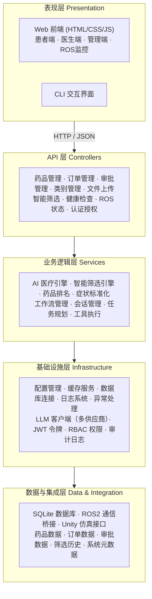
```mermaid
flowchart TB
    subgraph 表现层[表现层 Presentation]
        direction LR
        Web["Web 前端 (HTML/CSS/JS)<br/>患者端 · 医生端 · 管理端 · ROS监控"]
        CLI["CLI 交互界面"]
    end

    subgraph API层[API 层 Controllers]
        API["药品管理 · 订单管理 · 审批管理 · 类别管理 · 文件上传<br/>智能筛选 · 健康检查 · ROS 状态 · 认证授权"]
    end

    subgraph 业务逻辑层[业务逻辑层 Services]
        BIZ["AI 医疗引擎 · 智能筛选引擎 · 药品排名 · 症状标准化<br/>工作流管理 · 会话管理 · 任务规划 · 工具执行"]
    end

    subgraph 基础设施层[基础设施层 Infrastructure]
        INFRA["配置管理 · 缓存服务 · 数据库连接 · 日志系统 · 异常处理<br/>LLM 客户端（多供应商）· JWT 令牌 · RBAC 权限 · 审计日志"]
    end

    subgraph 数据与集成层[数据与集成层 Data & Integration]
        DATA["SQLite 数据库 · ROS2 通信桥接 · Unity 仿真接口<br/>药品数据 · 订单数据 · 审批数据 · 筛选历史 · 系统元数据"]
    end

    表现层 -->|HTTP / JSON| API层
    API层 --> 业务逻辑层
    业务逻辑层 --> 基础设施层
    基础设施层 --> 数据与集成层
```

### 1.2 组件划分

系统按功能拆分为 **5 大组件**，各组件职责明确、接口清晰：

| 编号 | 组件名称 | 核心模块 | 职责 |
|------|----------|----------|------|
| C1 | 数据库与基础设施 | `common/` `database/` `thought_logging/` | 配置、DB 工具、缓存、验证、日志 |
| C2 | 药品管理 API | `api/` `database/models/` | REST 控制器、数据模型、种子数据 |
| C3 | 智能筛选系统 | `screening/` | 症状匹配、排名引擎、筛选配置 |
| C4 | 权限认证系统 | `auth/` | JWT、RBAC、审计日志、用户管理 |
| C5 | ROS2 集成与前端 | `ros_integration/` `web/` `unity_simulation/` | ROS2 桥接、状态订阅、前端页面、Unity 3D 仿真 |

### 1.3 数据流（端到端）

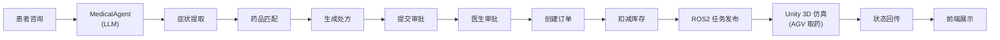
```mermaid
flowchart LR
    A["患者咨询"] --> B["MedicalAgent<br/>(LLM)"]
    B --> C["症状提取"]
    C --> D["药品匹配"]
    D --> E["生成处方"]
    E --> F["提交审批"]
    F --> G["医生审批"]
    G --> H["创建订单"]
    H --> I["扣减库存"]
    I --> J["ROS2 任务发布"]
    J --> K["Unity 3D 仿真<br/>(AGV 取药)"]
    K --> L["状态回传"]
    L --> M["前端展示"]
```

---

### 1.4 涉众与关注点 (Stakeholders & Concerns)

系统主要涉众及其关注点如下：

| 涉众 | 角色 | 核心关注点 | 质量属性 |
|------|------|-----------|----------|
| **患者** | 终端用户 | 咨询响应速度、药品推荐准确性、个人信息安全 | 性能、可用性、安全性 |
| **医生** | 审批者 | 审批流程效率、药品信息完整、患者历史可追溯 | 可用性、数据完整性 |
| **管理员** | 系统运维 | 库存管理便捷、用户权限可控、操作审计 | 可维护性、安全性 |
| **开发者** | 迭代维护 | 模块间解耦、接口清晰、可测试、可扩展 | 可修改性、可测试性 |
| **机器人** | 执行单元 | 任务指令准确、状态反馈实时、异常降级 | 响应性、可靠性 |

### 1.5 架构视图 (Architecture Views)

#### 1.5.1 部署视图 (Deployment View)

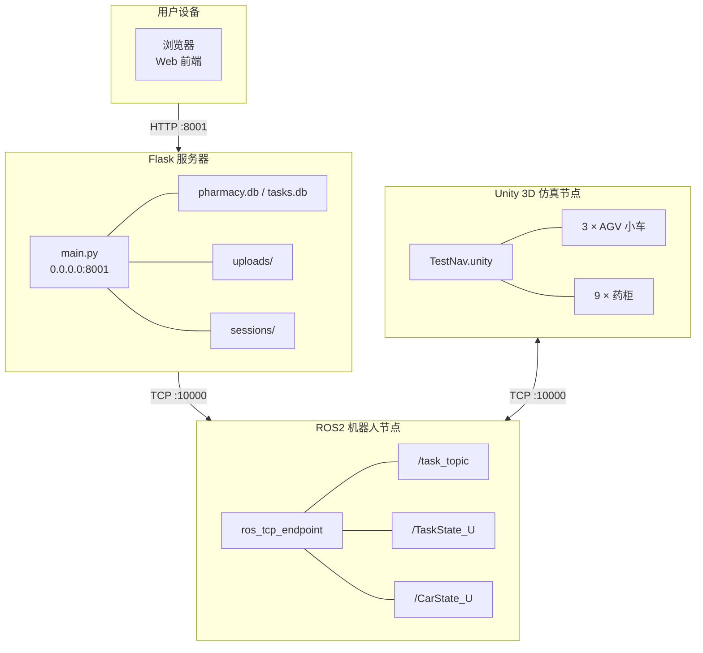
```mermaid
flowchart TB
    subgraph 用户设备[用户设备]
        Browser["浏览器<br/>Web 前端"]
    end

    subgraph Flask服务器[Flask 服务器]
        Flask["main.py<br/>0.0.0.0:8001"]
        DB["pharmacy.db / tasks.db"]
        Upload["uploads/"]
        Sessions["sessions/"]
        Flask --- DB
        Flask --- Upload
        Flask --- Sessions
    end

    subgraph ROS2节点[ROS2 机器人节点]
        ROS["ros_tcp_endpoint"]
        Topic1["/task_topic"]
        Topic2["/TaskState_U"]
        Topic3["/CarState_U"]
        ROS --- Topic1
        ROS --- Topic2
        ROS --- Topic3
    end

    subgraph Unity节点[Unity 3D 仿真节点]
        Unity["TestNav.unity"]
        Car["3 × AGV 小车"]
        Cabinet["9 × 药柜"]
        Unity --- Car
        Unity --- Cabinet
    end

    用户设备 -->|HTTP :8001| Flask服务器
    Flask服务器 -->|TCP :10000| ROS2节点
    Unity节点 <-->|TCP :10000| ROS2节点
```

#### 1.5.2 进程视图 (Process View)


```mermaid
flowchart LR
    subgraph Flask[Flask 主进程]
        direction TB
        F1["Cache eviction (60s)"]
        F2["Expiry sweep (daily)"]
        F3["Thought log flush"]
        F4["Session persistence"]
        FMain["main process"] --- F1
        FMain --- F2
        FMain --- F3
        FMain --- F4
    end

    subgraph ROS2[ROS2 Python 节点]
        direction TB
        R1["/task_topic (pub)"]
        R2["/TaskState_U (sub)"]
        R3["/CarState_U (sub)"]
        R4["/CabinetState_U (sub)"]
    end

    subgraph Unity[Unity 仿真引擎]
        direction TB
        U1["SendCarMsg (1.0s)"]
        U2["SendCabinetState (1.5s)"]
        U3["SendTaskState (2.0s)"]
        U4["PointCloud (0.5s)"]
        ULoop["Game Loop (协程)"]
        ULoop --> U1
        ULoop --> U2
        ULoop --> U3
        ULoop --> U4
    end

    Flask <-->|HTTP/JSON| ROS2
    ROS2 <-->|TCP/ROS| Unity
```

#### 1.5.3 逻辑视图 — 核心实体类图

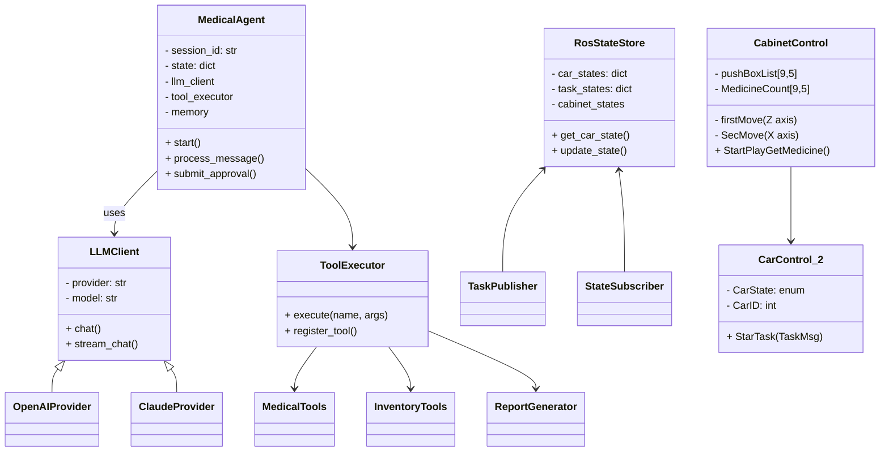
```mermaid
classDiagram
    class MedicalAgent {
        - session_id: str
        - state: dict
        - llm_client
        - tool_executor
        - memory
        + start()
        + process_message()
        + submit_approval()
    }

    class LLMClient {
        - provider: str
        - model: str
        + chat()
        + stream_chat()
    }

    class OpenAIProvider {
    }

    class ClaudeProvider {
    }

    class ToolExecutor {
        + execute(name, args)
        + register_tool()
    }

    class MedicalTools {
    }

    class InventoryTools {
    }

    class ReportGenerator {
    }

    class RosStateStore {
        - car_states: dict
        - task_states: dict
        - cabinet_states
        + get_car_state()
        + update_state()
    }

    class TaskPublisher {
    }

    class StateSubscriber {
    }

    class CabinetControl {
        - firstMove (Z axis)
        - SecMove (X axis)
        - pushBoxList[9,5]
        - MedicineCount[9,5]
        + StartPlayGetMedicine()
    }

    class CarControl_2 {
        - CarState: enum
        - CarID: int
        + StarTask(TaskMsg)
    }

    MedicalAgent --> LLMClient : uses
    LLMClient <|-- OpenAIProvider
    LLMClient <|-- ClaudeProvider
    MedicalAgent --> ToolExecutor
    ToolExecutor --> MedicalTools
    ToolExecutor --> InventoryTools
    ToolExecutor --> ReportGenerator
    RosStateStore <-- TaskPublisher
    RosStateStore <-- StateSubscriber
    CabinetControl --> CarControl_2
```

---

## 2. AI 医疗助手设计 (agent/)

### 2.1 设计目标

- 模拟医生问诊流程，通过多轮对话收集患者信息
- 结合 LLM 的语义理解能力进行症状分析和药品推荐
- 支持工具调用（Function Calling）实现与后端系统的交互

### 2.2 核心类设计

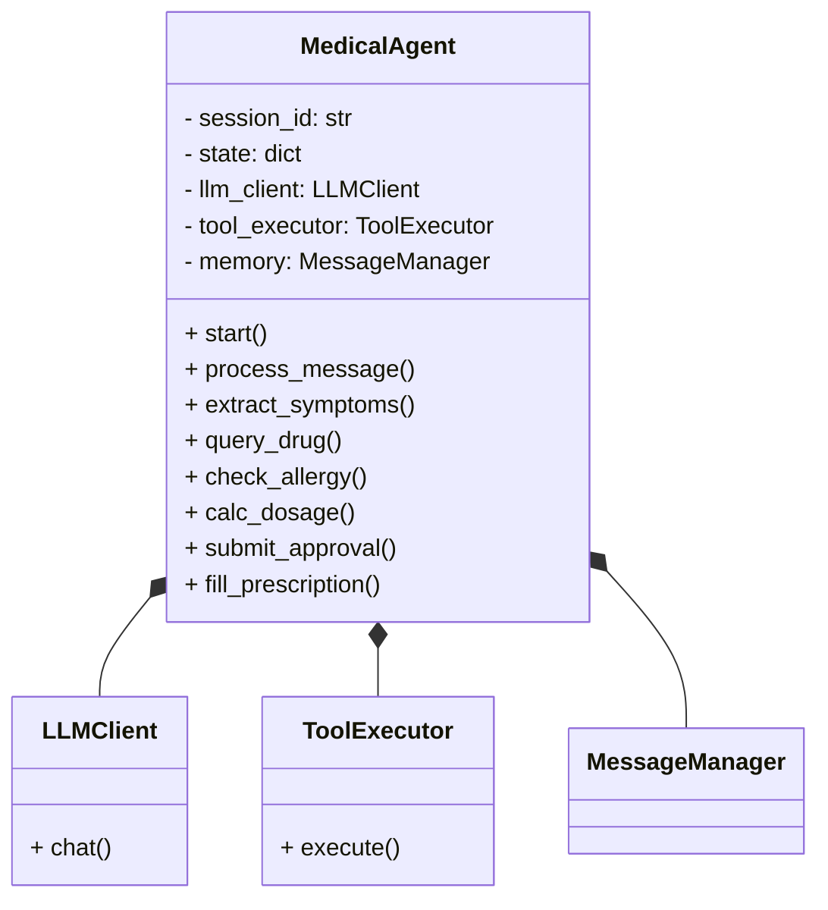
```mermaid
classDiagram
    class MedicalAgent {
        - session_id: str
        - state: dict
        - llm_client: LLMClient
        - tool_executor: ToolExecutor
        - memory: MessageManager
        + start()
        + process_message()
        + extract_symptoms()
        + query_drug()
        + check_allergy()
        + calc_dosage()
        + submit_approval()
        + fill_prescription()
    }

    class LLMClient {
        + chat()
    }

    class ToolExecutor {
        + execute()
    }

    class MessageManager {
    }

    MedicalAgent *-- LLMClient
    MedicalAgent *-- ToolExecutor
    MedicalAgent *-- MessageManager
```

### 2.3 工作流状态机

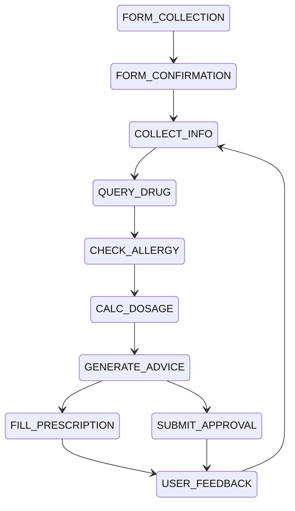
```mermaid
stateDiagram-v2
    FORM_COLLECTION --> FORM_CONFIRMATION
    FORM_CONFIRMATION --> COLLECT_INFO
    COLLECT_INFO --> QUERY_DRUG
    QUERY_DRUG --> CHECK_ALLERGY
    CHECK_ALLERGY --> CALC_DOSAGE
    CALC_DOSAGE --> GENERATE_ADVICE
    GENERATE_ADVICE --> SUBMIT_APPROVAL
    GENERATE_ADVICE --> FILL_PRESCRIPTION
    FILL_PRESCRIPTION --> USER_FEEDBACK
    SUBMIT_APPROVAL --> USER_FEEDBACK
    USER_FEEDBACK --> COLLECT_INFO
```

### 2.4 工具注册机制

通过 JSON Schema 定义工具接口，LLM 通过 Function Calling 调用：

| 工具名 | 功能 | 输入参数 |
|--------|------|----------|
| `query_drug` | 查询匹配症状的药品 | symptoms, age_group |
| `check_allergy` | 检查药物过敏 | drug_name, allergy_list |
| `calc_dosage` | 计算用药剂量 | drug_name, age, weight, condition |
| `generate_advice` | 生成用药建议 | drug_name, diagnosis, patient_info |
| `submit_approval` | 提交审批 | drug_name, dosage, patient_id |
| `fill_prescription` | 填充处方 | order_id, approval_id |

### 2.5 LLM 多供应商设计

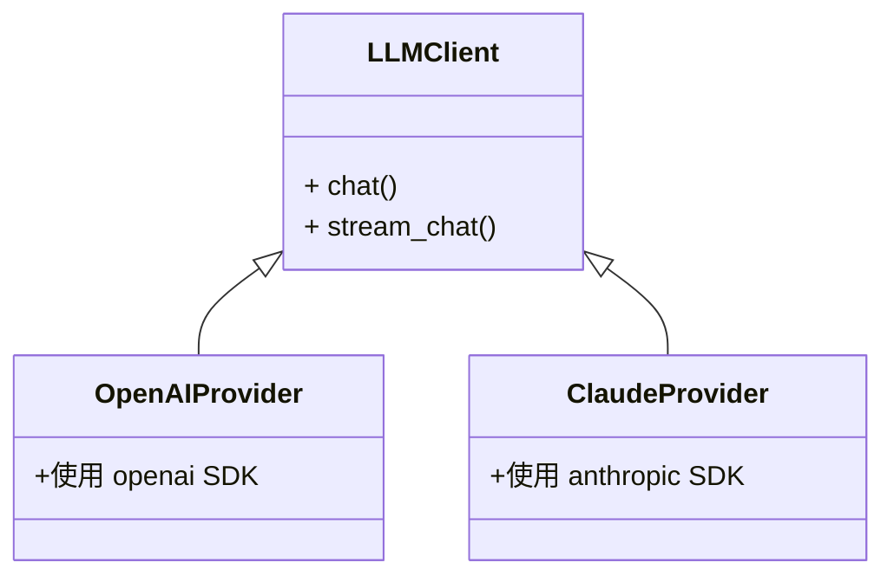
```mermaid
classDiagram
    class LLMClient {
        + chat()
        + stream_chat()
    }
    class OpenAIProvider {
        +使用 openai SDK
    }
    class ClaudeProvider {
        +使用 anthropic SDK
    }
    LLMClient <|-- OpenAIProvider
    LLMClient <|-- ClaudeProvider
```

通过 `LLM_PROVIDER` 环境变量切换，统一消息格式转换层将不同供应商的 API 格式归一化。

### 2.6 核心交互时序 — AI 问诊流程

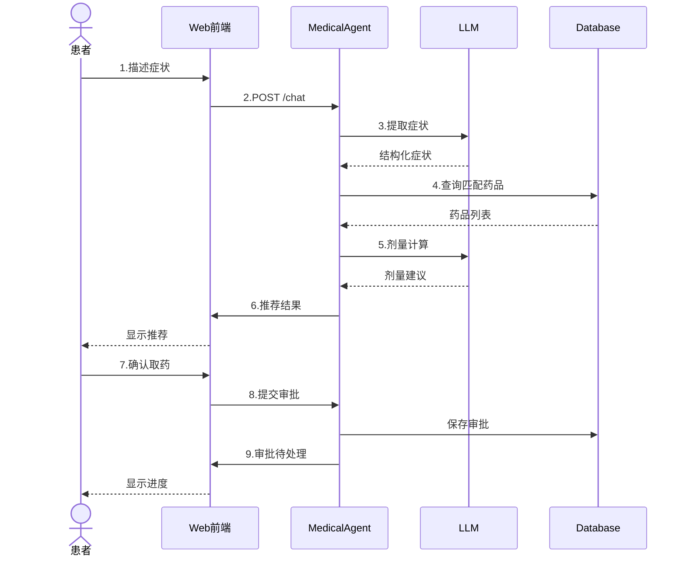
```mermaid
sequenceDiagram
    actor 患者
    participant Web as Web前端
    participant Agent as MedicalAgent
    participant LLM
    participant DB as Database

    患者->>Web: 1.描述症状
    Web->>Agent: 2.POST /chat
    Agent->>LLM: 3.提取症状
    LLM-->>Agent: 结构化症状
    Agent->>DB: 4.查询匹配药品
    DB-->>Agent: 药品列表
    Agent->>LLM: 5.剂量计算
    LLM-->>Agent: 剂量建议
    Agent->>Web: 6.推荐结果
    Web-->>患者: 显示推荐
    患者->>Web: 7.确认取药
    Web->>Agent: 8.提交审批
    Agent->>DB: 保存审批
    Agent->>Web: 9.审批待处理
    Web-->>患者: 显示进度
```

---

## 3. 药品管理 API 设计 (api/)

### 3.1 设计原则

- **RESTful 风格**：资源路径 + HTTP 动词
- **统一响应格式**：`{code, message, data, meta}`
- **分页与筛选**：支持 `page`, `per_page`, `sort_by`, `order` 参数
- **输入验证**：统一的 validation 层守卫所有写入端点

### 3.2 控制器清单

| 控制器 | 注册前缀 | 端点数量 | 主要功能 |
|--------|----------|----------|----------|
| `health_controller` | `/api/health` | 2 | 系统健康检查、ROS2 状态 |
| `drug_controller` | `/api/drugs` | 10 | 药品 CRUD、库存调整、批量导入、导出、统计 |
| `order_controller` | `/api/orders` | 3 | 订单创建、列表、详情 |
| `approval_controller` | `/api/approvals` | 6 | 审批 CRUD、审批/驳回操作 |
| `category_controller` | `/api/categories` | 2 | 类别列表、创建 |
| `upload_controller` | `/api/upload` | 3 | 文件上传、下载、删除 |
| `ros_state_controller` | `/api/ros` | 7 | 车辆状态、任务状态、柜子状态 |

### 3.3 统一响应格式

```json
{
  "code": 200,
  "message": "success",
  "data": { ... },
  "meta": {
    "page": 1,
    "per_page": 20,
    "total": 100,
    "pages": 5
  }
}
```

### 3.4 错误码体系

系统统一使用以下错误码分类（参考 HTTP 状态码语义扩展）：

| 错误码范围 | 类别 | 说明 | 示例 |
|-----------|------|------|------|
| `200` | 成功 | 请求成功处理 | GET /api/drugs 返回 200 |
| `201` | 创建成功 | 资源创建成功 | POST /api/drugs 返回 201 |
| `400` | 请求错误 | 参数校验失败、格式错误 | `{"code": 400, "message": "price 必须为正数"}` |
| `401` | 未认证 | JWT 缺失或过期 | `{"code": 401, "message": "Token expired"}` |
| `403` | 无权限 | RBAC 权限不足 | `{"code": 403, "message": "Permission denied: delete:drug"}` |
| `404` | 资源不存在 | 未找到指定资源 | `{"code": 404, "message": "Drug not found"}` |
| `409` | 冲突 | 资源已存在、库存不足 | `{"code": 409, "message": "库存不足: 当前 2, 需求 5"}` |
| `422` | 不可处理 | 业务规则违反 | `{"code": 422, "message": "处方药需医生审批"}` |
| `429` | 频率限制 | 请求过频 | `{"code": 429, "message": "Too many requests"}` |
| `500` | 服务器错误 | 内部异常 | `{"code": 500, "message": "Internal server error"}` |
| `503` | 服务不可用 | ROS2 断开、LLM 超时 | `{"code": 503, "message": "ROS2 not connected"}` |

接口规范补充：

```
请求头:
  Authorization: Bearer <access_token>
  Content-Type: application/json

分页参数:
  ?page=1&per_page=20&sort_by=name&order=asc

错误响应体:
  {
    "code": 4xx,
    "message": "错误描述",
    "errors": [{"field": "price", "message": "必须为正数"}]
  }
```

---

## 4. 数据库设计

### 4.1 数据库选型

- **主数据库**：SQLite 3.x，文件 `pharmacy.db`
- **选择理由**：零配置、单文件部署、跨平台、适合桌面级应用场景
- **任务数据库**：`tasks.db`，存储任务规划持久化数据

### 4.2 表结构总览

#### 药品库存表 (`inventory`)

| 列名 | 类型 | 说明 |
|------|------|------|
| `id` | INTEGER PK | 主键 |
| `drug_id` | TEXT UNIQUE | 药品编号 |
| `name` | TEXT | 药品名称 |
| `generic_name` | TEXT | 通用名 |
| `dosage_form` | TEXT | 剂型 |
| `strength` | TEXT | 规格 |
| `category` | TEXT | 分类 |
| `manufacturer` | TEXT | 生产商 |
| `quantity` | INTEGER | 库存数量 |
| `unit` | TEXT | 单位(默认"盒") |
| `price` | REAL | 零售价 |
| `purchase_price` | REAL | 进货价 |
| `min_stock_level` | INTEGER | 最低库存警戒 |
| `max_stock_level` | INTEGER | 最大库存量 |
| `expiry_date` | TEXT | 过期日期 |
| `indications` | TEXT(JSON) | 适应症数组 |
| `contraindications` | TEXT(JSON) | 禁忌症数组 |
| `drug_interactions` | TEXT(JSON) | 药物相互作用 |
| `pregnancy_category` | TEXT | 妊娠分级(A/B/C/D/X) |
| `age_restrictions` | TEXT(JSON) | 年龄限制 |
| `is_prescription` | BOOLEAN | 是否处方药 |
| `risk_level` | TEXT | 风险等级(低/中/高) |
| `barcode` | TEXT UNIQUE | 条形码 |
| `description` | TEXT | 描述 |

#### 药品适应症关联表 (`drug_indications`)

| 列名 | 类型 | 说明 |
|------|------|------|
| `id` | INTEGER PK | 主键 |
| `drug_id` | TEXT FK | 关联 inventory.drug_id |
| `indication` | TEXT | 适应症关键词 |

#### 症状同义词表 (`symptom_synonyms`)

| 列名 | 类型 | 说明 |
|------|------|------|
| `id` | INTEGER PK | 主键 |
| `standard_term` | TEXT | 标准术语 |
| `synonym` | TEXT UNIQUE | 同义词 |
| `match_type` | TEXT | 匹配类型(exact/similar/related) |

#### 分类表 (`categories`)

| 列名 | 类型 | 说明 |
|------|------|------|
| `id` | INTEGER PK | 主键 |
| `name` | TEXT UNIQUE | 分类名称 |
| `description` | TEXT | 描述 |
| `parent_id` | INTEGER FK | 父分类 ID（树形结构） |

#### 审批表 (`approvals`)

| 列名 | 类型 | 说明 |
|------|------|------|
| `id` | INTEGER PK | 主键 |
| `patient_id` | TEXT | 患者 ID |
| `doctor_id` | TEXT | 医生 ID |
| `drug_name` | TEXT | 药品名称 |
| `dosage` | TEXT | 剂量 |
| `status` | TEXT | 状态(pending/approved/rejected) |
| `symptom_description` | TEXT | 症状描述 |
| `created_at` | TIMESTAMP | 创建时间 |

#### 权限系统表 (auth_ 前缀，位于 `auth/schema.py`)

| 表名 | 说明 |
|------|------|
| `auth_roles` | 角色定义 (admin/pharmacist/doctor/patient) |
| `auth_permissions` | 权限码定义（14 个） |
| `auth_role_permissions` | 角色-权限多对多映射 |
| `auth_users` | 用户账户（含角色 FK） |
| `auth_refresh_tokens` | JWT 刷新令牌存储 |
| `auth_audit_logs` | 操作审计日志 |

### 4.3 数据库关系图

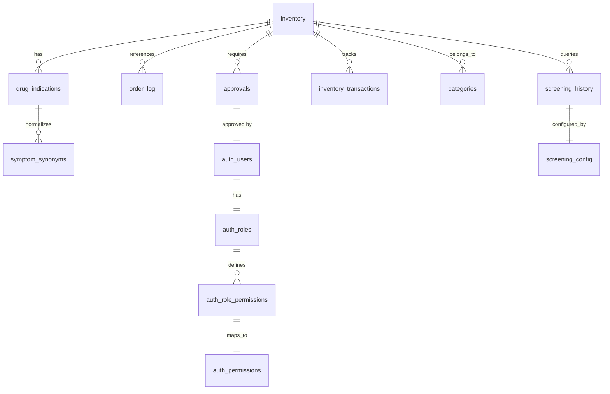
```mermaid
erDiagram
    inventory ||--o{ drug_indications : has
    inventory ||--o{ order_log : references
    inventory ||--o{ approvals : requires
    inventory ||--o{ inventory_transactions : tracks
    inventory ||--o{ categories : belongs_to
    drug_indications ||--o{ symptom_synonyms : normalizes
    approvals ||--|| auth_users : "approved by"
    auth_users ||--|| auth_roles : has
    auth_roles ||--o{ auth_role_permissions : defines
    auth_role_permissions ||--|| auth_permissions : maps_to
    inventory ||--o{ screening_history : queries
    screening_history ||--|| screening_config : configured_by
```

---

## 5. 智能筛选系统设计 (screening/)

### 5.1 设计目标

- 根据患者症状描述，从 116+ 种药品中智能匹配推荐
- 支持多维度排序（症状匹配度 + 药效 + 价格 - 禁忌惩罚）
- 提供非 LLM 降级方案，确保系统在没有 LLM 时仍可运行

### 5.2 核心流程

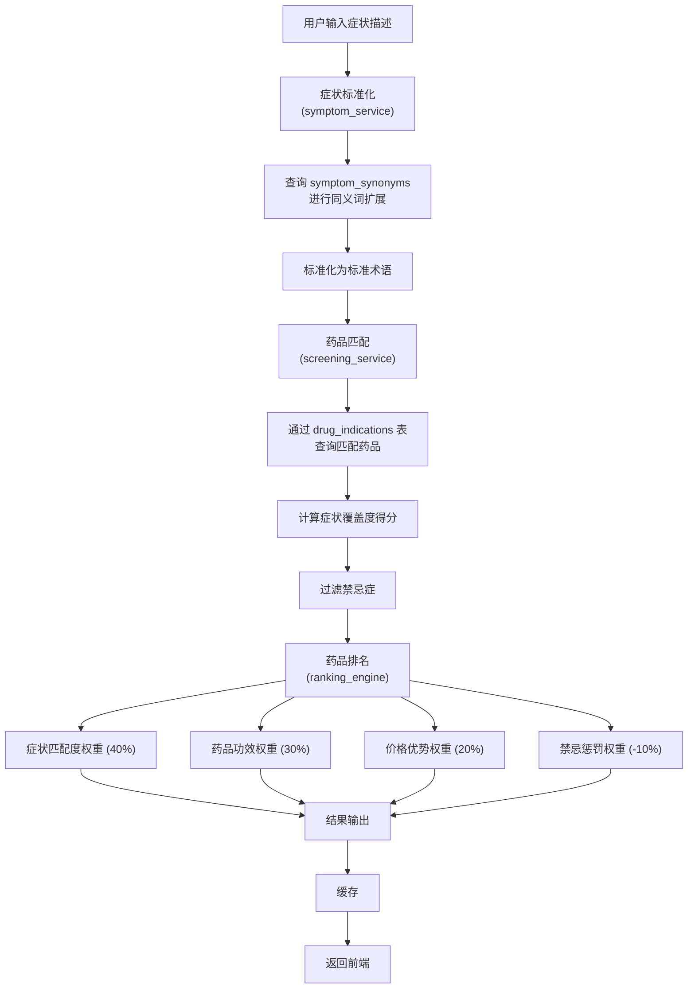
```mermaid
flowchart TB
    A["用户输入症状描述"] --> B["症状标准化<br/>(symptom_service)"]
    B --> B1["查询 symptom_synonyms<br/>进行同义词扩展"]
    B1 --> B2["标准化为标准术语"]
    B2 --> C["药品匹配<br/>(screening_service)"]
    C --> C1["通过 drug_indications 表<br/>查询匹配药品"]
    C1 --> C2["计算症状覆盖度得分"]
    C2 --> C3["过滤禁忌症"]
    C3 --> D["药品排名<br/>(ranking_engine)"]
    D --> D1["症状匹配度权重 (40%)"]
    D --> D2["药品功效权重 (30%)"]
    D --> D3["价格优势权重 (20%)"]
    D --> D4["禁忌惩罚权重 (-10%)"]
    D1 --> E["结果输出"]
    D2 --> E
    D3 --> E
    D4 --> E
    E --> F["缓存"]
    F --> G["返回前端"]
```

### 5.3 排名算法

```
score(drug, symptoms) =
    w_symptom × match_score(drug, symptoms) +
    w_efficacy × efficacy_score(drug) +
    w_price × price_score(drug) +
    w_contraindication × contra_penalty(drug, patient_info)

标准权重: w_symptom=0.40, w_efficacy=0.30, w_price=0.20, w_contraindication=-0.10
```

### 5.4 缓存策略

| 缓存键 | 有效期 | 说明 |
|--------|--------|------|
| `drug_list` | 120s | 药品列表缓存 |
| `drug_stats` | 60s | 药品统计缓存 |
| `drug_detail:{id}` | 300s | 单品详情缓存 |
| `categories` | 300s | 分类缓存 |

---

## 6. 权限认证系统设计 (auth/)

### 6.1 设计目标

- 基于 JWT 的无状态认证
- 基于 RBAC 的细粒度权限控制
- 完整的操作审计日志

### 6.2 JWT 令牌设计

| 令牌类型 | 有效期 | 用途 |
|----------|--------|------|
| Access Token | 24 小时 | API 请求认证 |
| Refresh Token | 7 天 | 令牌刷新 |

令牌载荷结构：
```json
{
  "sub": "user_id",
  "username": "admin1",
  "role": "admin",
  "permissions": ["read:drug", "create:drug", ...],
  "type": "access",
  "iat": 1234567890,
  "exp": 1234567890
}
```

### 6.3 角色-权限矩阵

| 权限 | 管理员 | 药师 | 医生 | 患者 |
|------|--------|------|------|------|
| read:drug | ✓ | ✓ | ✓ | ✓ |
| create:drug | ✓ | ✓ | - | - |
| update:drug | ✓ | ✓ | - | - |
| delete:drug | ✓ | - | - | - |
| batch:drug | ✓ | ✓ | - | - |
| read:inventory | ✓ | ✓ | ✓ | - |
| update:inventory | ✓ | ✓ | - | - |
| read:approval | ✓ | ✓ | ✓ | - |
| approve:approval | ✓ | ✓ | ✓ | - |
| reject:approval | ✓ | ✓ | ✓ | - |
| read:order | ✓ | ✓ | ✓ | - |
| read:users | ✓ | - | - | - |
| write:users | ✓ | - | - | - |
| read:audit | ✓ | - | - | - |

### 6.4 中间件链

```
Request → require_auth (JWT 验证)
         → require_permission (RBAC 检查)
         → 控制器处理
         → audit.log (审计记录)
```

---

## 7. ROS2 集成设计 (ros_integration/)

### 7.1 设计目标

- 作为 Web 后端与 ROS2 机器人之间的通信桥梁
- 支持任务发布、状态订阅、健康监控
- 优雅降级：ROS2 不可用时不影响 Web 业务

### 7.2 模块架构

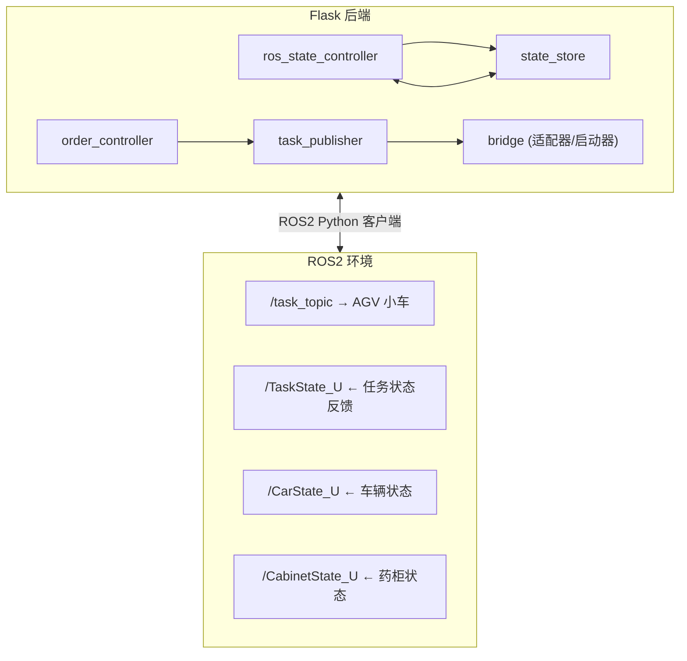
```mermaid
flowchart TB
    subgraph Flask后端[Flask 后端]
        RSC["ros_state_controller"]
        SS["state_store"]
        OC["order_controller"]
        TP["task_publisher"]
        Bridge["bridge (适配器/启动器)"]
        RSC --> SS
        SS <--> RSC
        OC --> TP
        TP --> Bridge
    end

    subgraph ROS2环境[ROS2 环境]
        Topic1["/task_topic → AGV 小车"]
        Topic2["/TaskState_U ← 任务状态反馈"]
        Topic3["/CarState_U ← 车辆状态"]
        Topic4["/CabinetState_U ← 药柜状态"]
    end

    Flask后端 <-->|ROS2 Python 客户端| ROS2环境
```

### 7.3 ROS2 消息定义 (`task_msgs/msg/`)

| 消息类型 | 字段 | 说明 |
|----------|------|------|
| `Task.msg` | task_id, type, target, medicine_data | 任务指令 |
| `TaskState.msg` | task_id, state, percentage, message | 任务状态 |
| `CarState.msg` | car_id, state, battery, position | 车辆状态 |
| `CabinetState.msg` | cabinet_id, state, door_state | 药柜状态 |
| `CabinetOrder.msg` | cabinet_id, type, medicine | 药柜指令 |
| `CabinetRunning.msg` | cabinet_id, status, detail | 药柜运行状态 |
| `MedicineData.msg` | name, quantity, position | 药品数据 |

### 7.4 状态存储

`RosStateStore` 采用线程安全的单例模式，维护三个状态映射表：

```
car_states: Dict[str, CarState]    # car_id → 最新车辆状态
task_states: Dict[str, TaskState]  # task_id → 最新任务状态
cabinet_states: Dict[str, CabinetState]  # cabinet_id → 最新柜子状态
```

### 7.5 优雅降级

当 ROS2 连接失败时：
1. `task_publisher` 进入重试模式（指数退避）
2. `state_subscriber` 标记为不可用
3. `health_monitor` 记录告警日志
4. API 层返回 `ros_connected: false` 但不影响其他业务
5. Web 前端显示 "ROS2 未连接" 提示

---

## 8. Unity 3D 仿真设计 (unity_simulation/)

### 8.1 设计目标

- 构建 3D 自动化药房仿真场景，可视化药品拣选全流程
- 通过 ROS-TCP-Endpoint 与 ROS2 后端双向通信，接收任务指令并回传状态
- 模拟药柜机械结构（轴运动、推药出盒）和 AGV 小车导航取药

### 8.2 场景架构

```
TestNav.unity（主场景）
├── 9 个药柜 (Cabinet_0 ~ Cabinet_8)    # 3×3 布局，自动化取药矩阵
│   ├── CabinetControl.cs               # 药柜机械控制（双轴、推药盒、柜门）
│   ├── 前移轴 (firstMove) — Z 轴行选择（9 个位置）
│   ├── 侧移轴 (SecMove)  — X 轴列选择（5 个位置）
│   ├── 推药盒 (pushBoxList[9,5])       # 45 个独立药盒
│   └── 柜门 (LeftRightBox[2])          # 取药时开合
│
├── 3 辆 AGV 小车 (Car / Car(1) / Car(2))
│   └── CarControl_2.cs                 # 任务执行、导航、防撞
│
├── SceneManager.cs                     # 全局单例协调器
├── Canvas (UI 覆盖层)
│   ├── 任务列表面板 (mainPanel)        # 按 F1 切换
│   └── 摄像头视角面板 (CameraPanel)    # 车辆跟随视角切换
│
├── CarMoveLine                         # 车辆行驶路径
├── HsCube / QyCube                     # 发货区 / 取药区动画平台
└── Main Camera + 灯光
```

### 8.3 药柜机械控制设计

`CabinetControl.cs` 模拟真实自动发药机的机械结构：

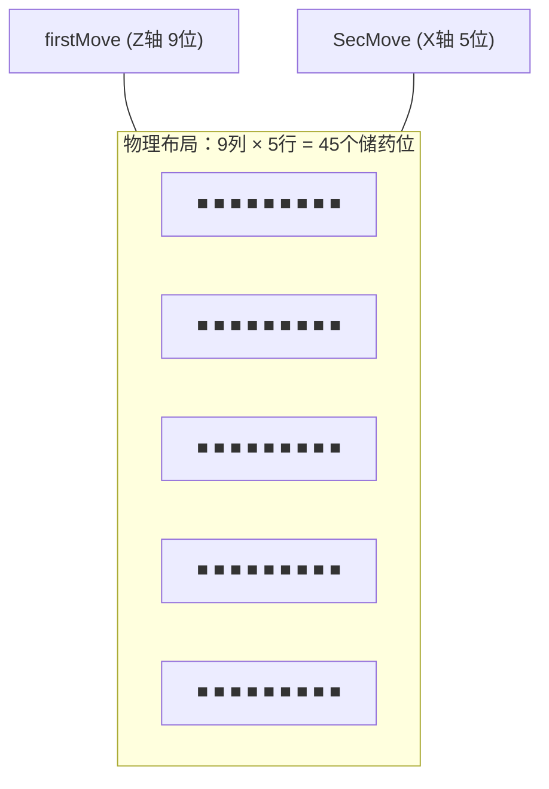
```mermaid
flowchart TB
    subgraph 物理布局[物理布局：9列 × 5行 = 45个储药位]
        direction LR
        M1["■  ■  ■  ■  ■  ■  ■  ■  ■"]
        M2["■  ■  ■  ■  ■  ■  ■  ■  ■"]
        M3["■  ■  ■  ■  ■  ■  ■  ■  ■"]
        M4["■  ■  ■  ■  ■  ■  ■  ■  ■"]
        M5["■  ■  ■  ■  ■  ■  ■  ■  ■"]
    end
    Z["firstMove (Z轴 9位)"] --- 物理布局
    X["SecMove (X轴 5位)"] --- 物理布局
```

取药流程：
1. 接收 `CabinetOrderMsg`（含药品行列坐标）
2. `MapToFixedInterval()` 将距离映射为动画时长（0→1s, 8→3s）
3. 双轴同时移动至目标位置
4. `MovePushBox()` 将药盒推出 0.22m
5. 递减 `MedicineCount[9,5]` 库存计数
6. 轴复位 + 柜门开合

### 8.4 AGV 小车导航设计

`CarControl_2.cs` 使用 DOTween 实现路径动画导航：

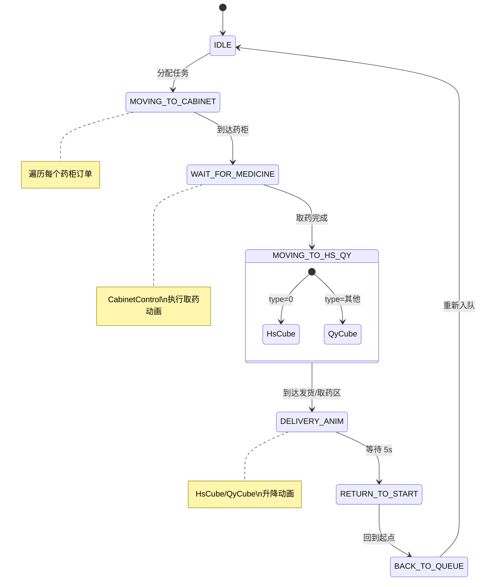
```mermaid
stateDiagram-v2
    [*] --> IDLE
    IDLE --> MOVING_TO_CABINET : 分配任务
    MOVING_TO_CABINET --> WAIT_FOR_MEDICINE : 到达药柜
    WAIT_FOR_MEDICINE --> MOVING_TO_HS_QY : 取药完成
    MOVING_TO_HS_QY --> DELIVERY_ANIM : 到达发货/取药区
    DELIVERY_ANIM --> RETURN_TO_START : 等待 5s
    RETURN_TO_START --> BACK_TO_QUEUE : 回到起点
    BACK_TO_QUEUE --> IDLE : 重新入队

    state MOVING_TO_HS_QY {
        [*] --> HsCube : type=0
        [*] --> QyCube : type=其他
    }

    note right of MOVING_TO_CABINET : 遍历每个药柜订单
    note right of WAIT_FOR_MEDICINE : CabinetControl\n执行取药动画
    note right of DELIVERY_ANIM : HsCube/QyCube\n升降动画
```

防撞机制：从 `CarCameraPos` 向前发射射线（`DeleteRayDis = 0.5m`），检测到障碍物时暂停 DOTween 动画。

### 8.5 ROS2 双向通信

#### 8.5.1 连接配置

- **协议**：TCP（`Unity.Robotics.ROSTCPConnector`）
- **IP 配置**：`StreamingAssets/ip.txt`（默认 `172.27.243.154:10000`）
- **预制体**：`ROSConnectionPrefab.prefab`，启用自动连接

#### 8.5.2 发布主题（Unity → ROS2，0.5~2.0s 间隔）

| 主题 | 消息类型 | 发布者 | 频率 | 内容 |
|------|----------|--------|------|------|
| `CarState_U` | `task_msgs/CarState` | `SendCarState.cs` | 1.0s | 车号、坐标、运行状态 |
| `CabinetState_U` | `task_msgs/CabinetState` | `SendCabinetState.cs` | 1.5s | 柜号、45 位库存数组 |
| `CabinetRunning_U` | `task_msgs/CabinetRunning` | `SendCabinet_Running.cs` | 1.2s | 柜号、是否运行中 |
| `TaskState_U` | `task_msgs/TaskState` | `SendTaskState.cs` | 2.0s | 任务 ID、状态、分配车号 |
| `PC2P1` | `sensor_msgs/PointCloud2` | `PointCloud2Publish.cs` | 0.5s | 360° 激光雷达点云 |
| `pos_rot` | 自定义 | `RosPublisherExample.cs` | — | 演示数据 |

#### 8.5.3 订阅主题（ROS2 → Unity）

| 主题 | 消息类型 | 订阅者 | 触发方式 |
|------|----------|--------|----------|
| `/unity_commands` | `task_msgs/Task` | `TaskSubscriber.cs` | 事件驱动 |

#### 8.5.4 传感器仿真

- **激光雷达**：`PointCloudRadar.cs` — 360 条射线，20m 距离，水平 360° 扫描，数据发布到 `PC2P1` 主题
- **相机图像**：`ROSImagePublish.cs` — 从 `RenderTexture` 通过 `AsyncGPUReadback` 捕获，RGB24 格式，按 Q 键触发发布

### 8.6 场景交互流程

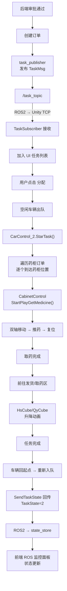
```mermaid
flowchart TB
    A["后端审批通过"] --> B["创建订单"]
    B --> C["task_publisher<br/>发布 TaskMsg"]
    C --> D["/task_topic"]
    D -->|ROS2 → Unity TCP| E["TaskSubscriber 接收"]
    E --> F["加入 UI 任务列表"]
    F --> G["用户点击 分配"]
    G --> H["空闲车辆出队"]
    H --> I["CarControl_2.StarTask()"]
    I --> J["遍历药柜订单<br/>逐个到达药柜位置"]
    J --> K["CabinetControl<br/>StartPlayGetMedicine()"]
    K --> L["双轴移动 → 推药 → 复位"]
    L --> M["取药完成"]
    M --> N["前往发货/取药区"]
    N --> O["HsCube/QyCube<br/>升降动画"]
    O --> P["任务完成"]
    P --> Q["车辆回起点 → 重新入队"]
    Q --> R["SendTaskState 回传<br/>TaskState=2"]
    R --> S["ROS2 → state_store"]
    S --> T["前端 ROS 监控面板<br/>状态更新"]
```

### 8.7 端到端时序 — 审批通过到机器人取药

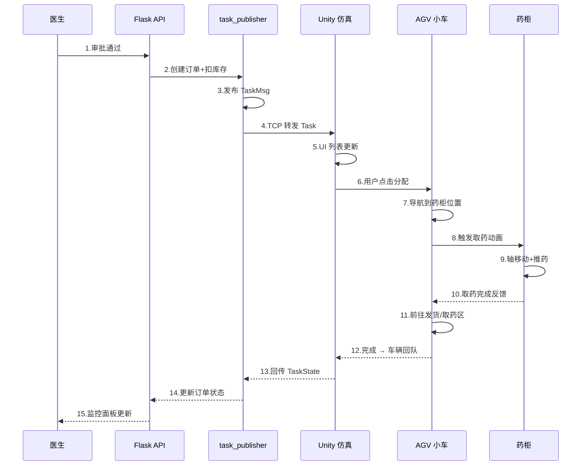
```mermaid
sequenceDiagram
    participant Doctor as 医生
    participant API as Flask API
    participant Pub as task_publisher
    participant Unity as Unity 仿真
    participant Car as AGV 小车
    participant Cabinet as 药柜

    Doctor->>API: 1.审批通过
    API->>Pub: 2.创建订单+扣库存
    Pub->>Pub: 3.发布 TaskMsg
    Pub->>Unity: 4.TCP 转发 Task
    Unity->>Unity: 5.UI 列表更新
    Unity->>Car: 6.用户点击分配
    Car->>Car: 7.导航到药柜位置
    Car->>Cabinet: 8.触发取药动画
    Cabinet->>Cabinet: 9.轴移动+推药
    Cabinet-->>Car: 10.取药完成反馈
    Car->>Car: 11.前往发货/取药区
    Car-->>Unity: 12.完成 → 车辆回队
    Unity-->>Pub: 13.回传 TaskState
    Pub-->>API: 14.更新订单状态
    API-->>Doctor: 15.监控面板更新
```

### 8.8 项目资产

| 资产 | 来源 | 说明 |
|------|------|------|
| `售卖系统装配.fbx` | 自主建模 | 药房机柜 3D 模型 |
| `yaopin.fbx` | 外部资源 | 药品盒模型（29 种纹理贴图） |
| DOTween | 第三方插件 | 动画补间库（车辆移动、药柜轴运动） |
| Dreamteck Splines | 第三方插件 | 样条路径系统（备用方案） |
| SimplePixelUI | 第三方插件 | UI 资源包 |
| ROS-TCP-Endpoint | Unity 官方包 | ROS-Unity TCP 通信桥 |
| GridPlane.shader | 自定义 | 网格地面着色器 |

---

## 9. 前端设计 (web/)

### 9.1 页面结构

```
web/
├── index.html          # 登录页/首页
├── patient.html        # 患者端：AI 咨询、查看处方、药品浏览
├── doctor.html         # 医生端：待审批列表、审批操作
├── admin.html          # 管理端首页：系统概览
├── admin_drugs.html    # 管理端：药品 CRUD 管理
├── admin_orders.html   # 管理端：订单管理
├── register.html       # 用户注册
├── ros_monitor.html    # ROS2 实时监控面板
├── css/
│   └── style.css       # 全局样式（41KB）
└── js/
    ├── api.js          # API 客户端封装（14KB）
    ├── app.js          # 应用逻辑
    └── utils.js        # 工具函数
```

### 9.2 API 客户端 (`api.js`)

统一封装的 HTTP 客户端：

```javascript
class ApiClient {
    baseURL: string
    token: string

    async request(method, path, data)
    async getDrugs(params)         // 药品列表
    async getDrugDetail(id)        // 药品详情
    async createApproval(data)     // 创建审批
    async getPendingApprovals()    // 待审批列表
    async approveApproval(id)      // 审批通过
    async rejectApproval(id, reason) // 审批驳回
    async getRosStatus()           // ROS2 状态
    async screeningQuery(data)     // 智能筛选
}
```

### 9.3 角色路由

| 页面 | 患者 | 医生 | 管理员 |
|------|------|------|--------|
| `patient.html` | ✓ | - | - |
| `doctor.html` | - | ✓ | - |
| `admin.html` | - | - | ✓ |
| `admin_drugs.html` | - | - | ✓ |
| `admin_orders.html` | - | - | ✓ |
| `ros_monitor.html` | - | ✓ | ✓ |

---

## 10. LLM 思考日志系统 (thought_logging/)

### 10.1 设计目标

- 完整记录 LLM 推理过程，便于调试和审计
- 支持多输出格式（JSON/文本）
- 最小化对业务代码的侵入

### 10.2 架构

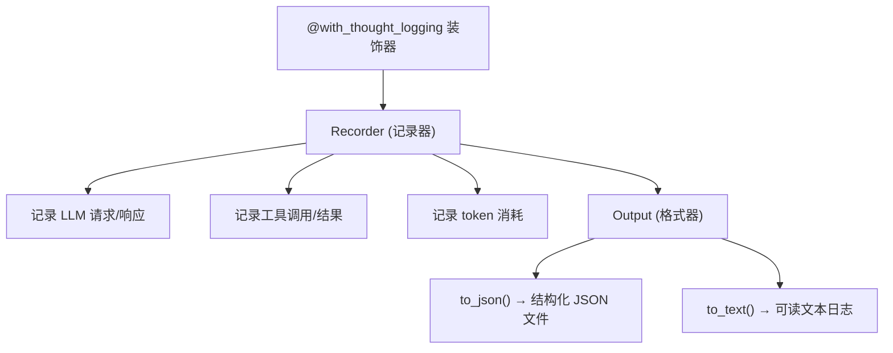
```mermaid
flowchart TB
    A["@with_thought_logging 装饰器"] --> B["Recorder (记录器)"]
    B --> B1["记录 LLM 请求/响应"]
    B --> B2["记录工具调用/结果"]
    B --> B3["记录 token 消耗"]
    B --> C["Output (格式器)"]
    C --> C1["to_json() → 结构化 JSON 文件"]
    C --> C2["to_text() → 可读文本日志"]
```

### 10.3 存储格式

```json
{
  "session_id": "xxx",
  "timestamp": "2026-04-17T10:00:00Z",
  "type": "llm_call",
  "provider": "openai",
  "model": "deepseek-chat",
  "messages": [...],
  "response": "...",
  "tool_calls": [...],
  "tool_results": [...],
  "tokens": {"prompt": 150, "completion": 200, "total": 350},
  "duration_ms": 1234
}
```

---

## 11. 缓存设计

### 11.1 缓存层次

```
L1: 内存缓存 (SimpleCache/DrugCache)
  ├── TTL 自动过期
  ├── 惰性淘汰 + 定时清理（每 60s）
  └── 线程安全（threading.Lock）

L2: 数据库查询缓存
  └── 相同查询在 TTL 内直接返回缓存结果
```

### 11.2 缓存键与 TTL

| 缓存键 | TTL | 失效时机 |
|--------|-----|----------|
| `drug_list:{params}` | 120s | 药品增删改后 |
| `drug_detail:{id}` | 300s | 药品更新后 |
| `drug_stats` | 60s | 药品变更后 |
| `categories` | 300s | 分类变更后 |
| `screening:query:{hash}` | 600s | 筛选配置变更后 |

---

## 12. 安全设计

### 12.1 认证与授权

- **密码存储**：SHA-256 哈希（可通过配置升级为 bcrypt）
- **JWT 签名**：HS256 算法，密钥通过 `AUTH_JWT_SECRET` 配置
- **RBAC 权限**：基于数据库的动态权限检查，支持细粒度到端点级别

### 12.2 输入防护

- **SQL 注入防护**：全部使用参数化查询（`?` 占位符）
- **XSS 防护**：前端输出编码
- **CORS 配置**：通过 `CORS_ORIGINS` 限制跨域来源

### 12.3 审计日志

- 记录所有关键操作：用户 ID、操作类型、资源、IP、时间戳
- 审计日志持久化到 `auth_audit_logs` 表，支持查询和统计

---

## 13. 关键算法设计

### 13.1 药品匹配评分算法

```
score = symptom_coverage × 0.40 + efficacy × 0.30
        + (1 - price/max_price) × 0.20 - contraindication_penalty × 0.10

symptom_coverage = matched_symptoms / total_symptoms
efficacy = base_efficacy × age_factor × pregnancy_factor
contraindication_penalty = matched_contraindications / total_contraindications
```

### 13.2 症状同义词扩展

```
用户输入: "肚子疼"
    ↓ 查询 symptom_synonyms
标准化: "腹痛"
    ↓ 查询 drug_indications
匹配药品: [颠茄片, 藿香正气水, ...]
```

### 13.3 缓存淘汰策略

- **惰性淘汰**：读取时检查 TTL，过期则重新查询并更新缓存
- **定时淘汰**：后台线程每 60s 扫描一次，清理过期条目
- **写入淘汰**：药品数据变更时主动清除相关缓存

---

## 14. 项目开发路线

### 14.1 总体时间线

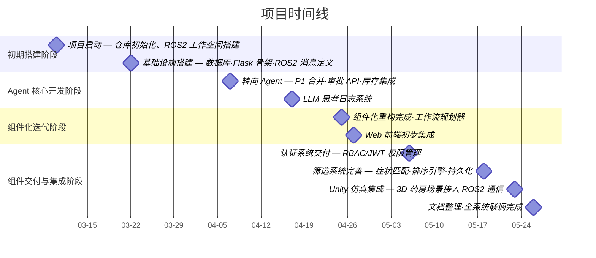
```mermaid
gantt
    title 项目时间线
    dateFormat  MM-DD
    axisFormat  %m-%d

    section 初期搭建阶段
    项目启动 — 仓库初始化、ROS2 工作空间搭建    :milestone, m1, 03-10, 0d
    基础设施搭建 — 数据库·Flask 骨架·ROS2 消息定义 :milestone, m2, 03-22, 0d

    section Agent 核心开发阶段
    转向 Agent — P1 合并·审批 API·库存集成       :milestone, m3, 04-07, 0d
    LLM 思考日志系统                             :milestone, m4, 04-17, 0d

    section 组件化迭代阶段
    组件化重构完成·工作流规划器                    :milestone, m5, 04-25, 0d
    Web 前端初步集成                             :milestone, m6, 04-27, 0d

    section 组件交付与集成阶段
    认证系统交付 — RBAC/JWT 权限管理              :milestone, m7, 05-06, 0d
    筛选系统完善 — 症状匹配·排序引擎·持久化        :milestone, m8, 05-18, 0d
    Unity 仿真集成 — 3D 药房场景接入 ROS2 通信     :milestone, m9, 05-23, 0d
    文档整理·全系统联调完成                       :milestone, m10, 05-26, 0d
```

### 14.2 里程碑

| 里程碑 | 交付物 |
|--------|--------|
| M1 项目启动 | 仓库初始化、ROS2 工作空间 |
| M2 基础设施 | 数据库设计、后端骨架 |
| M3 Agent 核心 | LLM 集成、工具调用系统 |
| M4 审批流程 | 审批 API、状态管理 |
| M5 权限系统 | JWT 认证、RBAC、审计日志 |
| M6 智能筛选 | 症状匹配、排名引擎 |
| M7 ROS2 集成 | 任务发布、状态订阅 |
| M8 Unity 仿真 | 3D 药房仿真接入 |
| M9 文档与联调 | 全系统联调、文档整理 |

---

## 15. 配置与环境

### 15.1 核心配置项

```python
class Config:
    # 服务
    HOST = "0.0.0.0"
    PORT = 8001

    # 数据库
    DATABASE_PATH = "pharmacy.db"

    # LLM
    LLM_PROVIDER = "openai"  # openai | claude
    LLM_MODEL = "deepseek-chat"

    # Agent
    MAX_HISTORY_LEN = 20
    MAX_ITERATIONS = 15

    # 缓存
    CACHE_TTLS = {
        "drug_list": 120,
        "drug_detail": 300,
        "stats": 60,
        "categories": 300,
    }

    # ROS2
    ENABLE_ROS2 = True

    # 思考日志
    ENABLE_THOUGHT_LOGGING = True
```

---

## 16. 设计决策记录

| 决策 | 选择 | 备选方案 | 理由 |
|------|------|----------|------|
| 数据库 | SQLite | PostgreSQL/MySQL | 零配置部署，单文件管理，适合桌面级场景 |
| 缓存 | 内存 TTL 缓存 | Redis | 避免额外依赖，内存开销可控 |
| 认证 | JWT + RBAC | Session/Casbin | 无状态、跨平台、细粒度权限控制 |
| LLM 供应商 | OpenAI 协议 | 仅单一供应商 | 兼容 DeepSeek/OpenAI 等多种模型 |
| 前端 | 原生 HTML/JS | React/Vue | 轻量、零构建步骤、快速迭代 |
| ROS2 通信 | ros_tcp_endpoint | ROS2 native | 统一 ROS-Unity TCP 通信协议 |
| 消息格式 | JSON | Protocol Buffers | 人类可读、调试方便、无需编译步骤 |
| ROS2 断开降级 | 状态标记 + 重试 | 硬依赖 | 保证 Web 业务不受机器人状态影响 |
| SQL 访问 | 参数化查询 | ORM (SQLAlchemy) | 轻量、零依赖、直接控制 SQL |

---

## 17. 质量属性场景 (Quality Attribute Scenarios)

定义关键质量属性及其验证场景：

### 17.1 性能 (Performance Efficiency)

| 场景 | 描述 | 当前基线 | 目标 |
|------|------|----------|------|
| API 响应时间 | GET /api/drugs 药品列表查询 | ~120ms (100 条) | P95 < 500ms |
| 药品筛选 | POST /api/screening/query 智能筛选 | ~800ms (含 LLM) | P95 < 2s |
| 静态页面加载 | Web 前端页面完整加载 | ~200ms | < 1s |
| 缓存命中率 | DrugCache 缓存药品列表命中率 | — | > 70% |

### 17.2 可用性 (Availability)

| 场景 | 应对策略 | 指标 |
|------|----------|------|
| LLM 服务不可用 | 降级为非 LLM 症状匹配（基于 symptom_synonyms 表） | 筛选系统仍可工作，准确率下降 |
| ROS2 节点断开 | task_publisher 指数退避重试，API 返回 ros_connected: false | Web 业务零影响 |
| 数据库文件损坏 | 定时备份策略（文档未实现，待补充） | RTO < 30min |
| 并发请求过载 | 线程池 + 请求排队（MAX_CONCURRENT_SESSIONS） | 拒绝超限请求而非崩溃 |

### 17.3 可修改性 (Modifiability)

| 变更场景 | 影响范围 | 耦合度分析 |
|----------|----------|-----------|
| 新增 LLM 供应商 | 仅修改 `llm/providers/` 目录，新增 Provider 子类 | 低 — 适配器模式 |
| 新增 API 端点 | 新增 controller 文件，注册 Blueprint，main.py 追加一行 | 低 — 独立注册 |
| 修改筛选算法 | 仅修改 `screening/services/ranking_engine.py` | 低 — 单一职责 |
| 替换数据库 | 需重写 `common/utils/database.py` 的 SQL 语句 | 中 — SQL 分散在各 controller |
| 修改 ROS2 消息格式 | 更新 `message_adapter.py` 转换逻辑 | 低 — 适配器隔离 |

### 17.4 安全性 (Security)

| 场景 | 防护措施 | 验证方式 |
|------|----------|----------|
| 未认证访问 API | `@require_auth` 装饰器守卫 | 401 返回测试 |
| 越权操作 | `@require_permission(code)` RBAC 检查 | 403 返回测试 |
| SQL 注入 | 全部参数化查询 `?` 占位符 | 渗透测试 |
| JWT 伪造 | HS256 签名 + 服务端密钥 | 篡改 token 签名后请求验证 |

---

## 18. 设计约束 (Design Constraints)

### 18.1 技术约束

| 约束 | 来源 | 影响 |
|------|------|------|
| 必须使用 SQLite | 部署环境限制（无独立数据库服务器） | 不支持并发写、不支持存储过程、数据量上限 ~TB 级 |
| 前端不可引入构建工具 | 团队前端技能栈限制（无 Node.js/npm 环境） | 使用原生 HTML/CSS/JS，无 SPA 框架 |
| ROS2 Humble | 机器人硬件支持的 ROS2 发行版 | 固件兼容性限制，升级需硬件配合 |
| Unity 2022.3.31f1 LTS | 仿真团队使用的 Unity 版本 | 项目文件不可用更高版本打开 |
| 同时支持 OpenAI 与 DeepSeek | 教学环境 API 供应不稳定 | 需要多供应商抽象层 |

### 18.2 业务约束

| 约束 | 说明 |
|------|------|
| 演示账号体系 | 预设 admin1/doctor1/patient1 三组演示账号，不可删除 |
| 药品数据固定 | 初始种子数据 116 种药品 + 599 条适应症为固定的演示数据集 |
| 审批流程强制 | 所有处方药品必须经过医生审批才能进入取药流程 |
| 单机部署 | 系统设计为单机部署模式，不涉及分布式协调 |

### 18.3 时间约束

- 项目周期：2026 年 3 月 10 日 — 2026 年 5 月 26 日（~10 周）
- Agent 核心优先策略：先验证 AI 问诊可行性 → 再拆分 5 组件并行开发
- Unity 仿真作为独立模块集成，不影响 Web 业务功能交付

---

## 19. 并发与同步策略

### 19.1 线程模型

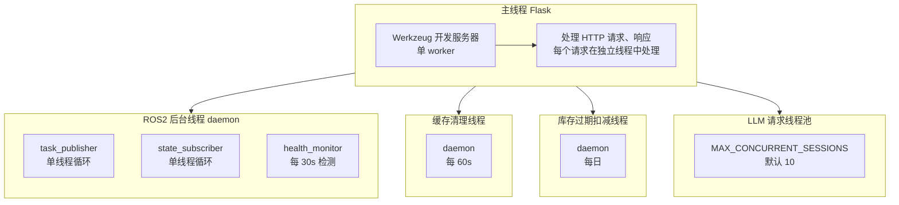
```mermaid
flowchart TB
    subgraph Main[主线程 Flask]
        M1["Werkzeug 开发服务器<br/>单 worker"]
        M2["处理 HTTP 请求、响应<br/>每个请求在独立线程中处理"]
        M1 --> M2
    end

    subgraph ROS2[ROS2 后台线程 daemon]
        direction TB
        R1["task_publisher<br/>单线程循环"]
        R2["state_subscriber<br/>单线程循环"]
        R3["health_monitor<br/>每 30s 检测"]
    end

    subgraph Cache[缓存清理线程]
        C1["daemon<br/>每 60s"]
    end

    subgraph Expiry[库存过期扣减线程]
        E1["daemon<br/>每日"]
    end

    subgraph LLM[LLM 请求线程池]
        L1["MAX_CONCURRENT_SESSIONS<br/>默认 10"]
    end

    Main --> ROS2
    Main --> Cache
    Main --> Expiry
    Main --> LLM
```

### 19.2 锁策略

| 资源 | 锁机制 | 说明 |
|------|--------|------|
| `RosStateStore` 状态字典 | `threading.Lock` | 保护 car_states/task_states/cabinet_states 并发读写 |
| `DrugCache` 缓存 | `threading.Lock` | 保护缓存字典的读写 |
| 库存扣减 | 无锁（SQLite 事务保证） | 单机部署下无竞争条件 |
| 会话管理器 | `threading.Lock` | 保护多患者会话的并发存取 |

### 19.3 SQLite 并发限制

- SQLite 支持多读单写（WAL 模式下可并发读）
- 写操作串行化（文件级锁），高并发写入场景不适用
- 当前架构下，Flask 单 worker + SQLite 满足演示负载需求
- 写操作频率：~10 次/分钟（审批 + 订单 + 库存），远低于 SQLite 上限

### 19.4 Unity 仿真并发

- Unity 主循环（Game Loop）为单线程更新
- ROS 消息发送通过协程（Coroutine）按固定间隔执行
- 无多线程竞争，协程间共享 `TaskList`、`carQueue` 等资源
- `CarControl_2.StarTask()` 使用协程链实现顺序动画，无阻塞

---

## 20. 需求追溯矩阵 (Requirements Traceability)

| 功能需求 | 设计实现 | 对应组件 | 验证方式 |
|----------|----------|----------|----------|
| AI 症状咨询 | `MedicalAgent.process_message()` + `symptom_extractor.py` | C1 + Agent | 端到端对话测试 |
| 药品查询 | `GET /api/drugs` + `drug_controller.py` | C2 | API 测试 |
| 智能药品筛选 | `screening_service.py` + `ranking_engine.py` | C3 | 单元测试 + 准确率验证 |
| 用户认证 | JWT 令牌 + `/api/auth/login` | C4 | 认证测试 |
| 权限控制 | `@require_permission` 装饰器 | C4 | 权限越权测试 |
| 审批流程 | `POST /api/approvals` + 审批/驳回操作 | C2 | 流程测试 |
| 订单创建 | `POST /api/orders` + 库存扣减 | C2 | 集成测试 |
| ROS2 任务派发 | `task_publisher.py` → `/task_topic` | C5 | 消息验证 |
| Unity 仿真取药 | `CarControl_2.StarTask()` + `CabinetControl.StartPlayGetMedicine()` | C5 | 场景测试 |
| 审计日志 | `audit.py` → `auth_audit_logs` 表 | C4 | 日志查询测试 |
