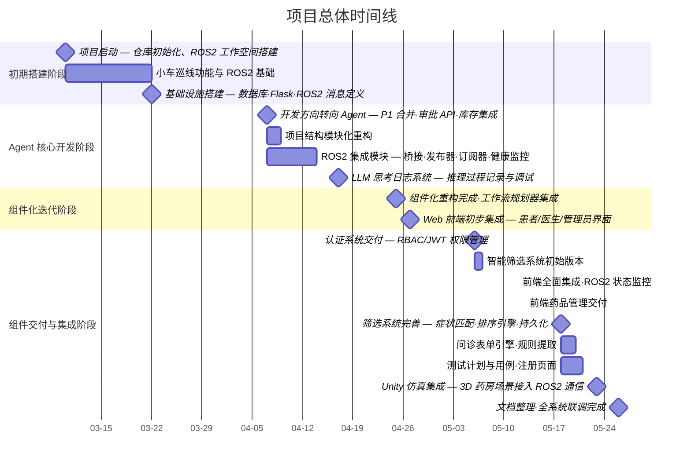

# 项目研发报告 — 基于 ROS2 的智能药品管理系统

## 1. 项目任务及研发过程

### 1.1 项目背景与任务

本项目旨在构建一套基于 ROS2 的智能药品管理系统，集成 AI 医疗咨询、自动化药房后端与 ROS2 机器人控制，实现从患者问诊到机器人自动取药的完整工作流。系统覆盖以下核心业务场景：

- **AI 医疗咨询**：患者通过自然语言描述症状，AI Agent 分析症状、推荐药品、计算剂量
- **药房管理**：药品 CRUD、库存管理、批次导入、临期预警
- **审批流程**：医生审核 AI 建议，批准/拒绝用药方案
- **ROS2 机器人调度**：审批通过后自动派发取药任务至机器人
- **Unity 3D 仿真**：可视化药房场景，模拟机器人取药过程

### 1.2 研发过程概述

项目研发自 2026 年 3 月启动，历时约 2.5 个月。研发策略上，团队采取了"**先核心验证、再分工细化**"的方式：前期集中攻克 AI Agent 核心链路，快速产出可运行的简易 Demo，验证系统可行性后，再按照架构组件拆分为并行角色，正式进入迭代开发阶段。各阶段具体如下：

| 阶段 | 时间 | 主要活动 |
|------|------|----------|
| 项目启动与基础设施搭建 | 2026-03-10 ~ 2026-03-22 | 仓库初始化、ROS2 工作空间搭建、数据库设计、Flask 后端骨架 |
| 核心后端功能开发 | 2026-04-07 ~ 2026-04-16 | 药品 API、审批流程、AI Agent 引擎、子代理系统、工具链 |
| 大模型集成与对话系统 | 2026-04-16 ~ 2026-04-25 | LLM 客户端封装、多轮对话管理、工作流引擎、思考日志模块 |
| 组件化重构与前端集成 | 2026-04-25 ~ 2026-05-12 | 项目按组件重构、Web 前端开发、ROS2 桥接集成 |
| 权限系统与智能筛选 | 2026-05-06 ~ 2026-05-18 | RBAC/JWT 认证、智能药品筛选引擎、评分排序系统 |
| 仿真集成与系统联调 | 2026-05-18 ~ 2026-05-26 | Unity 仿真接入、ROS2 状态监控、全流程集成测试、文档完善 |

---

## 2. 项目组及成员分工安排

### 2.1 团队构成

项目初期由 6 名成员组成。启动阶段，团队优先构建了一个端到端的简易 Demo（包含基础 Agent 对话、药品查询和审批流程），以快速验证系统可行性与技术路线。该 Demo 通过验证后，团队继续依据《团队分工方案 2 - 按架构组件分工（修订版）》将系统拆分为五个并行角色，进入正式迭代开发阶段。

### 2.2 成员分工（按个人）

| 成员 | 角色 | 主要贡献 |
|------|------|----------|
| 唐若芸| 项目协调人 | 项目架构设计与联调、AI Agent demo、项目管理与文档 |
| 吴羽彤 | 数据库与基础架构 | 药品表扩展、新表创建、缓存层、分页与响应格式规范 |
| 央金灵卓 | 药品管理 API | 药品 CRUD、分类管理、批量导入导出、库存管理、搜索增强 |
| 黄语菲 | 智能筛选系统 | 症状标准化、药品匹配排序、筛选 API、非 LLM 降级链路 |
| 李佳澄 | 权限认证系统 | JWT 认证、RBAC 权限控制、@require_permission 装饰器、审计日志 |
| 白家榕 | 前端界面联调 | 登录页面、API 对接、7 个页面 mock 数据切换、联调修复 |


### 2.3 协作模式

项目采用 GitHub 作为代码托管与协作平台，基于分支开发 + Pull Request 的协作流程：

- **主分支**（`main` / `demo0425`）：集成稳定功能
- **特性分支**：按组件/功能创建独立分支（如 `worktree-phase1-implementation`、`P1_0509`、`P3_0507`）
- **合并策略**：通过 Pull Request 或本地合并，关键合并附带冲突解决记录

---

## 3. 项目组进度和里程碑

### 3.1 总体时间线



### 3.2 关键里程碑

| 里程碑 | 日期 | 说明 |
|--------|------|------|
| M1: 项目基础设施搭建 | 2026-03-22 | 数据库初始化、Flask 后端基本架构、ROS2 消息定义 |
| M2: AI 医疗助手原型 | 2026-04-16 | Agent 引擎、症状提取、工具链、多轮对话基础流程 |
| M3: LLM 思考日志系统 | 2026-04-17 | 完整的 LLM 推理过程记录与调试功能 |
| M4: 组件化重构完成 | 2026-04-25 | 按功能组件重构项目结构，清理遗留代码 |
| M5: Web 前端集成 | 2026-04-27 | 患者/医生/管理员前端界面初步可用 |
| M6: 认证系统交付 | 2026-05-06 | RBAC/JWT 权限管理完成 |
| M7: 智能筛选系统交付 | 2026-05-18 | 症状匹配、药品排序完成 |
| M8: 仿真场景集成 | 2026-05-23 | Unity 3D 仿真接入 ROS2 通信 |
| M9: 全系统集成与文档 | 2026-05-26 | 所有组件联调，文档完整 |

---

## 4. 项目开发过程中不同阶段采用的关键技术

### 4.1 后端基础架构阶段

| 技术 | 用途 |
|------|------|
| **Python 3.12** | 主开发语言 |
| **Flask** | Web 框架，提供 REST API |
| **SQLite** | 嵌入式数据库，存储药品、用户、订单、审批等数据 |
| **Blueprint 模块化** | Flask Blueprint 实现控制器级别模块化 |
| **Connection Pool** | 数据库连接池管理，提高并发访问性能 |

### 4.2 AI Agent 与 LLM 集成阶段

| 技术 | 用途 |
|------|------|
| **OpenAI / DeepSeek API** | 大语言模型调用，支持多提供商切换 |
| **Function Calling** | LLM 工具调用，实现药品查询、剂量计算等具体操作 |
| **三阶段工作流引擎** | 基础信息采集 → 表单收集 → 药品匹配的阶段化管理 |
| **子代理架构** | 症状提取器、表单收集引擎的独立子代理系统 |
| **智能消息压缩** | 长对话历史的 Token 管理，自动摘要压缩 |
| **Tool Registry** | 工具注册与动态调度，支持医疗/库存/报告生成工具 |

### 4.3 认证与权限阶段

| 技术 | 用途 |
|------|------|
| **JWT** | JSON Web Token 访问令牌与刷新令牌 |
| **RBAC** | 基于角色的访问控制（患者、医生、管理员） |
| **装饰器中间件** | `@require_auth` 和 `@require_permission` 路由保护 |
| **审计日志** | 关键操作（登录、审批、权限变更）的记录与追踪 |

### 4.4 智能筛选系统阶段

| 技术 | 用途 |
|------|------|
| **同义词映射** | 症状标准化（如"头痛"↔"头疼"↔"cephalalgia"），支持数据库级匹配 |
| **多维度评分排序** | 综合症状匹配度、药效、价格、过敏筛查的评分引擎 |
| **Redis 缓存** | TTL 缓存提高药品查询与症状匹配性能 |
| **规则引擎** | 紧急症状红旗检测、年龄禁忌、过敏过滤 |

### 4.5 ROS2 集成阶段

| 技术 | 用途 |
|------|------|
| **rclpy** | ROS2 Python 客户端库 |
| **多线程节点管理** | ROS2 后台线程生命周期管理 |
| **ROS2-TCP-Endpoint** | Unity-ROS2 跨平台通信桥接 |
| **消息适配器** | 后台数据格式与 ROS2 消息格式的双向转换 |
| **健康监控** | 连接健康检查与自动恢复机制 |

### 4.6 仿真与前端阶段

| 技术 | 用途 |
|------|------|
| **Unity 3D** | 药房场景 3D 建模与仿真 |
| **DOTween** | Unity 动画缓动插件 |
| **Dreamteck Splines** | 样条曲线导航路径规划 |
| **原生 HTML/CSS/JS** | 响应式 Web 前端，无额外框架依赖 |

---

## 5. 项目开发过程中使用的辅助工具

| 工具 | 用途 |
|------|------|
| **Git / GitHub** | 版本控制、代码托管、协作开发 |
| **Claude Code** | AI 辅助编程、代码生成、重构与调试 |
| **OpenAI API** | LLM 驱动的 AI 医疗咨询能力 |
| **VSCode** | 主要集成开发环境 |
| **pytest** | 单元测试与集成测试框架 |
| **prompt_toolkit** | CLI 交互式命令行界面 |
| **httpx** | 异步 HTTP 客户端（API 调用） |
| **tenacity** | 重试机制库 |
| **Makefile** | 项目构建与任务自动化 |
| **Unity 2022.3** | 3D 仿真场景开发 |
| **SQLite Browser** | 数据库可视化查看与调试 |

---

## 6. 项目实现的功能关键算法说明

### 6.1 三阶段 Agent 工作流引擎

**文件**：`agent/engine/medical_agent.py`

AI 医疗助手采用三阶段状态机驱动的工作流：


- **阶段 A**：采集患者基础信息（年龄、性别、过敏史），识别主诉症状
- **阶段 B**：通过引导式问答逐步收集症状详情（ onset、duration、severity 等）
- **阶段 C**：基于完整信息进行药品匹配和推荐

状态转换由 `workflows.py` 中的 `WorkflowStage` 枚举管理，每次 LLM 响应后检查阶段切换条件。

### 6.2 症状提取与同义词匹配算法

**文件**：`agent/subagents/extractor.py`、`agent/subagents/symptom_extractor.py`

采用双模架构：

1. **规则匹配模式**：基于关键词词典和否定词检测（如"没有发烧"→ 排除"发烧"）
2. **LLM 提取模式**：当规则匹配不足时，调用 LLM 从自然语言中提取症状

同义词映射通过数据库表 `symptom_synonyms` 实现，支持多语言同义词（中文 ↔ English），采用数据库级 JOIN 查询进行高效匹配。

### 6.3 药品多维度评分排序引擎

**文件**：`screening/services/ranking_engine.py`

综合评分公式：

```
总分 = w₁ × 症状匹配度 + w₂ × 药效评分 + w₃ × 价格评分 - w₄ × 禁忌惩罚
```

- **症状匹配度**：基于症状同义词映射的加权 Jaccard 相似度
- **过敏过滤**：患者过敏药物标记为不可用，评分置零
- **年龄禁忌**：根据患者年龄过滤不适用的药品
- **紧急症状检测**：识别红旗症状（如胸痛、呼吸困难），触发紧急提示

### 6.4 智能对话记忆压缩

**文件**：`agent/memory/compressor.py`

当对话历史超过 Token 阈值时自动触发压缩：

1. 将早期对话消息发送至 LLM 生成摘要
2. 用摘要替换原始消息序列
3. 保留最近的 N 轮对话完整上下文
4. 系统提示始终保持在压缩窗口之外

### 6.5 JWT 令牌管理

**文件**：`auth/tokens.py`

- **访问令牌**：短期有效（默认 15 分钟），包含用户 ID、角色、权限列表
- **刷新令牌**：长期有效（默认 7 天），支持安全刷新
- **权限验证**：装饰器 `@require_permission` 通过令牌中的权限列表进行细粒度访问控制

### 6.6 ROS2 任务调度

**文件**：`ros_integration/task_publisher.py`

审批通过后自动触发 ROS2 任务发布：

- **取药任务**：包含药品名称、数量、药柜位置
- **过期清理任务**：定时扫描过期药品并发布清理指令
- **归队任务**：完成任务后发布归队指令

支持新格式、旧格式和并行三种发布模式，确保与不同版本的 ROS2 节点兼容。

---

## 7. 项目研发过程中发现并排除的问题/缺陷

### 7.1 缺陷统计

根据 Git 提交记录，项目累计修复 **32 个** 明确的 bug/缺陷，涵盖以下类别：

| 类别 | 数量 | 典型问题 |
|------|------|----------|
| 导入与模块路径 | 7 | 模块导入路径错误、缺少 `__init__.py`、ROS2 工作区绝对路径问题 |
| API 与数据格式 | 6 | 响应格式不一致（`drugs` vs `data` 字段）、缺少 CORS、状态码错误 |
| 数据库与模型 | 5 | 字段名不规范（`transaction_id` 等）、数据库路径配置不统一、会话管理 |
| LLM/Agent 逻辑 | 4 | Tool call 序列化错误、类型检查缺失、审批模块导入循环依赖 |
| 认证与权限 | 3 | 权限常量不一致、蓝图注册顺序错误、中间件缺失 |
| 前端兼容性 | 3 | 接口联调问题、页面跳转逻辑、样式冲突 |
| 环境与配置 | 2 | API 密钥安全泄露、环境变量模板缺失 |
| 测试与代码质量 | 2 | 测试函数缺失、代码审查问题 |

### 7.2 重要缺陷案例

| 问题 | 发现时间 | 影响 | 解决方案 |
|------|----------|------|----------|
| LLM Tool call 序列化失败 | 2026-04-25 | Agent 工具调用崩溃 | 修复 Pydantic 模型序列化，添加自定义 JSON encoder |
| API 密钥硬编码泄露 | 2026-04-07 | 安全风险 | 迁移至环境变量，添加 `.env.example` 和安全指南 |
| 数据库路径硬编码不一致 | 2026-04-09 | 多处数据库路径不统一导致连接失败 | 统一使用 `Config.DATABASE_PATH` |
| 审批库存扣减异常 | 2026-05-18 | 库存不足时未正确处理 | 添加库存预检和友好错误提示 |
| 症状提取器否定词误判 | 2026-04-16 | "没有头痛"被识别为包含"头痛" | 实现否定词过滤规则 |

---

## 8. 项目相关工作量统计数据

### 8.1 需求功能点

| 功能模块 | 功能点 | 说明 |
|---------|--------|------|
| AI 医疗咨询 | 15 | 症状分析、药品推荐、剂量计算、多轮对话、工作流引擎等 |
| 药品管理 | 12 | CRUD、库存调整、批量导入、CSV 导出、低库存预警等 |
| 审批流程 | 8 | 审批单 CRUD、批准/拒绝、库存联动、任务触发 |
| 认证权限 | 10 | 注册登录、JWT 令牌、RBAC、角色管理、审计日志 |
| 智能筛选 | 8 | 症状匹配、评分排序、历史记录、配置管理等 |
| ROS2 集成 | 6 | 任务发布、状态订阅、健康监控、消息适配 |
| Unity 仿真 | 5 | 场景建模、物理仿真、ROS2 通信、路径规划 |
| Web 前端 | 10 | 患者/医生/管理员界面、监控面板、注册页面 |
| CLI 界面 | 4 | 患者 CLI、医生 CLI、交互模式、简化模式 |
| **合计** | **78** | |

### 8.2 文档规模

| 文档类别 | 文件数 | 总行数 | 说明 |
|----------|--------|--------|------|
| 项目说明文档 | 1 | ~450 | 系统架构、数据流、接口清单、配置指南 |
| 代码说明文档 | 1 | ~480 | 代码组织结构、来源分类、文件说明 |
| 组件 API 文档 | 4 | ~600+ | 药品 API、筛选 API、接口对照表 |
| 技术实施方案 | 4 | ~500+ | 分工方案、架构设计、改造方案 |
| 仿真文档 | 3 | ~300+ | 仿真接入方案、ROS2 通信、交互说明 |
| 测试文档 | 3 | ~200+ | 测试计划、测试分析、快速参考 |
| 其他文档 | 5 | ~300+ | 前端接入说明、使用指南等 |
| **合计** | **21** | **~2,830+** | |

### 8.3 代码规模

| 类别 | 文件数 | 代码行数 | 说明 |
|------|--------|----------|------|
| Python 源码 | 128 | ~25,904 | 主后端系统（agent_with_backend） |
| Web 前端 | 12 | ~3,200+ | 8 个 HTML 页面、3 个 JS 文件、1 个 CSS |
| Shell 脚本 | 5 | ~400+ | 启动、测试、运维脚本 |
| ROS2 消息定义 | 7 | ~80+ | .msg 消息类型文件 |
| Unity C# 脚本 | 1 | ~100+ | Unity 测试脚本 |
| **合计** | **153** | **~29,684+** | |

---

## 9. 项目管理与质量保障活动

### 9.1 项目管理

| 活动 | 说明 |
|------|------|
| **GitHub 仓库管理** | 使用 `main` / `demo0425` 作为集成分支，按组件创建特性分支进行并行开发 |
| **版本控制规范** | 提交信息采用 Angular 风格（`feat:`、`fix:`、`docs:`、`refactor:`、`chore:` 等前缀） |
| **分支策略** | 组件分支（`P1_*`、`P3_*`）+ 特性分支 + 集成分支，通过合并解决冲突 |
| **工作树隔离** | 使用 `git worktree` 实现并行开发环境隔离 |

### 9.2 过程管理

| 活动 | 说明 |
|------|------|
| **每周例会** | 每周二和周四上课时间，团队成员到教室集中讨论当前进度，当面确认遇到的问题并制定后续规划，确保各组件开发方向一致 |
| **文档同步** | 通过 `docs/` 目录的文档更新同步设计变更和接口规范 |
| **组件接口对齐** | 各组件在开发过程中会提交足够详细的接口文档与说明资料（包括 API 端点定义、请求/响应格式、权限矩阵、数据模型等），以便其他角色清晰了解组件的调用方式与依赖关系，降低联调阶段的集成成本 |

### 9.3 配置管理

| 活动 | 说明 |
|------|------|
| **环境变量管理** | 通过 `.env` / `.env.example` 统一管理配置，敏感信息不提交至仓库 |
| **依赖管理** | `requirements.txt` 管理 Python 依赖，`package.xml` 管理 ROS2 依赖 |
| **编译产物排除** | `.gitignore` 排除 `venv/`、`__pycache__/`、Unity 编译产物等 |
| **数据库版本管理** | SQLite 数据库文件纳入版本控制（开发和测试数据），通过脚本初始化 |

### 9.4 质量管理

| 活动 | 说明 |
|------|------|
| **代码审查** | 通过 Pull Request 和合并过程中的代码审查发现并修复问题 |
| **测试计划** | 制定完整的测试计划文档，涵盖测试策略、测试用例设计 |
| **代码规范** | 统一代码风格（去除尾随空格、统一缩进等），重构遗留代码 |
| **CI/CD 集成** | GitHub 作为代码托管平台，支持持续集成工作流 |


---