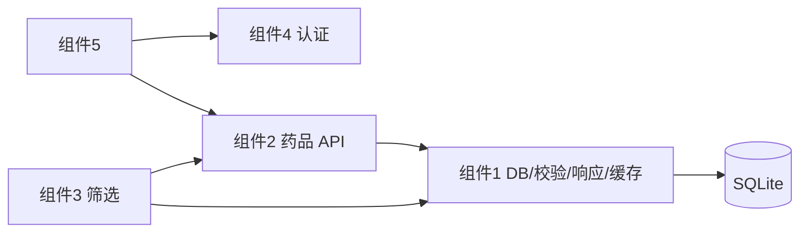

# 组件1：数据库与基础架构

本文分两大部分：**A** 为组件边界与对外契约（供组件2～5 联调）；**B** 为交付进展与差异说明。  
代码路径前缀：`agent_with_backend/`。  
**更新时间**：2026-05-19（第 1～3 周）

> HTTP 药品/订单/认证/筛选等路由清单见各组件文档（如 `组件2药品API.md`）或 `main.py` 注册的 Blueprint；**本文只写组件1 负责的部分**。

---

# A. 组件边界与对外契约

## 一、系统角色



| 组件1 负责 | 组件1 不负责 |
|---|---|
| SQLite Schema、幂等迁移、`get_db_connection()` | `GET /api/drugs` 等业务路由（组件2） |
| `response.py` 统一 envelope | JWT/RBAC 实现（组件4，`auth/`） |
| `validation.py` 校验规则 | 筛选算法与 `/api/screening/*`（组件3） |
| `cache.py` 进程内 TTL 缓存 | ROS2 任务发布（`ros_integration`） |
| `drug_service.py` 共享查库 | 文件上传/对象存储（未实现） |
| `GET /api/health`（含 `cache.info()`） | |

---

## 二、组件1 管理的文件

| 路径 | 说明 |
|---|---|
| `common/utils/database.py` | `get_db_connection()`、`init_database()`，DDL |
| `database/connection.py` | 与上表 DDL 同步 |
| `database/scripts/init_db.py` | 命令行初始化 + categories 种子 |
| `common/utils/validation.py` | `validate_drug` 等 |
| `common/utils/response.py` | 成功/失败/分页响应 |
| `common/utils/cache.py` | `get_drug_cache()`（第 3 周） |
| `common/utils/drug_service.py` | `query_drugs`、`get_drug` |
| `common/utils/__init__.py` | 上述模块的公共导出 |
| `api/health_controller.py` | 健康检查 |

与组件2 **共管**（改 Schema/缓存失效前需协调）：`api/drug_controller.py`、`api/category_controller.py`。

---

## 三、对外提供的接口

### 3.1 Python 接口（组件2/3 直接 import）

```python
from common.utils.database import get_db_connection, init_database
from common.utils import (
    get_drug_cache,
    validate_drug,
    validate_category,
    validate_inventory_transaction,
    validate_pagination_params,
    success_response,
    bad_request_response,
    parse_pagination,
)
from common.utils.drug_service import query_drugs, get_drug
```

| 符号 | 用途 |
|---|---|
| `get_db_connection()` | SQLite 连接，`row_factory=Row`，**已** `PRAGMA foreign_keys=ON` |
| `init_database()` | 幂等建表/迁移 |
| `validate_drug` / `validate_category` / `validate_inventory_transaction` | 与药品/分类/库存写接口同一套规则 |
| `success_response` 等 | 药品/分类推荐使用的 JSON envelope |
| `parse_pagination` | `page` / `limit` / `offset`（`limit` 上限 100） |
| `query_drugs` / `get_drug` | 无 HTTP 的共享查询 |
| `get_drug_cache()` | 进程单例缓存（见 §3.4） |

### 3.2 HTTP（组件1 直接提供）

| 方法 | 路径 | 说明 |
|:---:|---|---|
| GET | `/api/health` | `success`、`ros2`、`details.cache`（`get_drug_cache().info()`） |
| GET | `/api/health/ros2` | ROS2 状态 |

### 3.3 数据库 Schema 摘要

| 表 | 要点 |
|---|---|
| `inventory` | **41 列**（7 原始 + 28 组件2 扩展 + 6 组件1 扩展）；业务库存只用 **`quantity`** |
| `categories` | 树形分类；**13 条**种子；与药品 JOIN：`inventory.category = categories.name`（字符串，非 FK） |
| `inventory_transactions` | 审计流水；`quantity_change`、`transaction_type`（`in`/`out`/`adjust`/`expire`） |
| `drug_indications` | 适应症（组件3 筛选） |
| `symptom_synonyms` | 症状同义词（组件3） |
| `order_log` | 订单（组件2 写） |
| `auth_*` | 认证表由组件4 `ensure_auth_schema()` 管理；`init_db.py` 仅注释勿重复建表 |

**组件1 在 `inventory` 上额外 6 列**（均有默认值，可不传）：  
`strength`、`drug_interactions`、`age_restrictions`、`min_stock_level`、`max_stock_level`、`purchase_price`。

### 3.4 数据约定（全组遵守）

| 约定 | 说明 |
|---|---|
| `quantity` vs `stock` | 库存以 **`quantity`** 为准；`stock` 兼容列新写入固定 `0` |
| `expiry_date` | **剩余有效天数（整数）**，不是日历日期 |
| `is_deleted` | 软删除；列表/详情/统计默认排除 `is_deleted=1` |
| 外键 | 所有 `get_db_connection()` 已启用；非法 `drug_id` 写流水会 `IntegrityError` |

### 3.5 统一响应（`response.py`）

成功：

```json
{
  "success": true,
  "data": {},
  "pagination": null,
  "error": null
}
```

失败（药品/分类等）：

```json
{
  "success": false,
  "error": { "code": "VALIDATION_ERROR", "message": "..." }
}
```

| 说明 | |
|---|---|
| 列表药品数组在顶层 **`data`** 中（非顶层 `drugs`） | |
| 鉴权失败（组件4）常为扁平 **`error_code`**，与上表嵌套 `error` 不同，前端需分支解析 | |
| 订单/审批等部分端点仍为历史 `jsonify` 形态，以源码为准 | |

### 3.6 校验要点（`validate_drug` 创建必填）

`name`、`quantity`、`expiry_date`、`shelf_x`、`shelf_y`、`shelve_id`  

失败：`400`，`error.code = "VALIDATION_ERROR"`。扩展字段长度与规则见 `common/utils/validation.py`。

### 3.7 缓存层（第 3 周，`common/utils/cache.py`）

| 方法 | TTL | 说明 |
|---|---|---|
| `get_drug_list` / `set_drug_list` | 120 s | 列表；键含 symptom/name/category/sort |
| `get_stats` / `set_stats` | 60 s | 对接 `/api/drugs/stats` |
| `get_drug` / `set_drug` | 300 s | 单药详情 |
| `get_categories` / `set_categories` | 300 s | flat / tree |
| `invalidate_drug_writes(drug_id?)` | — | 药品写操作后调用（在 `commit` 之后） |
| `invalidate_categories()` | — | 分类写后调用 |

组件2 已在 `drug_controller` / `category_controller` 集成；组件3 可 `cache.get_drug_list(symptom=...)` 复用列表缓存。

---

## 四、各组件依赖一览

### 4.1 → 组件2（药品 API）

| 依赖 | 状态 |
|---|---|
| `get_db_connection` / Schema / `inventory_transactions` DDL | ✅ |
| `validate_drug`、`validate_inventory_transaction` | ✅ |
| `response.py` 分页与 envelope | ✅ |
| `get_drug_cache` + Controller 集成 | ✅ |
| `inventory` 列数 | ✅ **41 列**（文档若写 35 列请更正） |
| 文件上传 | ❌ 未提供；批量导入用 JSON |

### 4.2 → 组件3（智能筛选）

| 依赖 | 状态 |
|---|---|
| `symptom_synonyms`、`drug_indications` 表及种子 | ✅ |
| `get_db_connection`、`categories` | ✅ |
| `get_drug_cache()` | ✅ 可直接复用 |
| `/api/screening/*` | 组件3 自有；**当前无 RBAC** |

### 4.3 → 组件4（认证）

| 依赖 | 状态 |
|---|---|
| `auth_users` + RBAC 表、`users` 视图 | ✅ 由 `ensure_auth_schema()` 管理 |
| 与业务同库 `Config.DATABASE_PATH` | ✅ |
| 组件1 配合 | ✅ `init_db.py` 注释说明，不重复建 auth 表 |

### 4.4 → 组件5（前端）

| 依赖 | 状态 |
|---|---|
| 药品/分类 API 的 `{success, data, pagination}` | ✅ |
| JWT `Authorization: Bearer` | ✅ 组件4 |
| 药品接口须带权限码 | ✅ 见组件2 权限矩阵 |
| 错误体 | ⚠️ 鉴权扁平 / 药品嵌套，需分支解析 |

---

## 五、联调差异（精简）

| # | 事项 | 建议 |
|---|------|------|
| 1 | `inventory` 41 列 vs 文档 35 列 | 以本表为准，多 6 列有默认值 |
| 2 | 药品错误嵌套 `error` vs 鉴权扁平 `error_code` | 前端按路径解析 |
| 3 | `GET /api/drugs` 列表数据在 `data` 数组 | 勿读顶层 `drugs` |
| 4 | 导出接口可能为 `data: { drugs, count }` | 与列表形状不同 |
| 5 | `/api/screening/*` 无鉴权 | 公网需网关限制 |
| 6 | 文件上传 | 未实现，非阻塞 |

---

## 六、初始化命令

```bash
cd agent_with_backend

# 幂等建表/迁移
python3 -m database.scripts.init_db

# 完整药品种子（会重写 inventory，慎用）
python3 -m database.scripts.seed_drugs
```

组件1 自测：

```bash
python3 -m pytest tests/test_component1_weeks1_3.py -v
```

---

# B. 开发进展（第 1～3 周）

| 周次 | 交付 | 状态 |
|:---:|---|:---:|
| 1 | `inventory` +6 列；三处 DDL 同步 | ✅ |
| 2 | `categories`、`inventory_transactions`；`validation`/`response` 导出；软删除口径 | ✅ |
| 3 | `cache.py`；外键；`health` 暴露 cache；对照表与组件2 Controller 缓存集成 | ✅ |

**第 4 周可选（非第三周欠账）**：`main.py` 定时 `evict_expired`；协助组件3 接缓存；文件上传视课程要求。

---

**说明**：路由与权限码细节以 `api/*_controller.py`、`auth/constants.py` 为准；组件2 接口手册见 `docs/组件2-药品API接口手册.md`。
